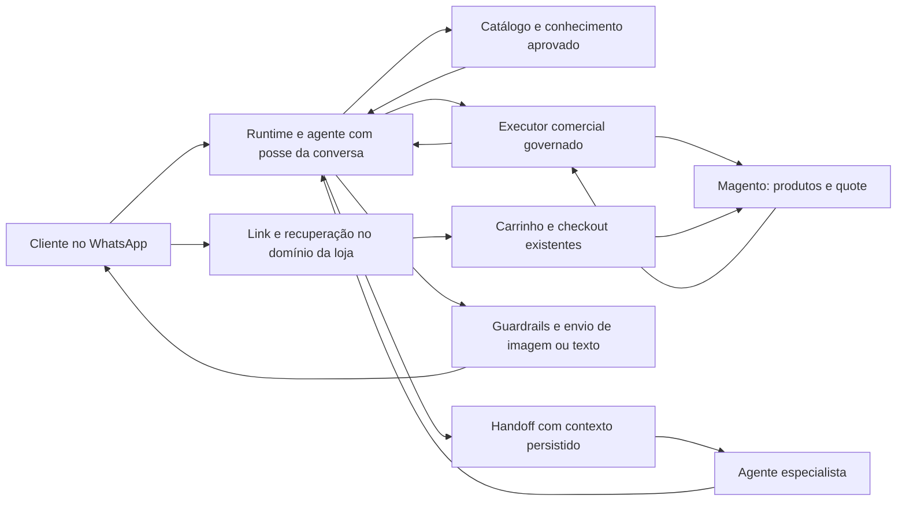

# Plano — concierge de compras Magento e transferência entre agentes

Data: 2026-09-06. Estado: **Entrega 1 (prova vertical do carrinho) provada num OpenMage local**; Entregas 2+ (conector, catálogo, concierge) ainda não implementadas.
Base de código auditada: `b7ee43a3`, igual a `origin/main` após `git fetch origin` nesta sessão.
Loja de referência: <https://ia.genialiaviamentos.com.br>.

### Progresso — Entrega 1 (prova vertical do carrinho)

Rodada localmente contra um OpenMage descartável (Docker, `.context/magento-lts-dev/`,
gitignored — não faz parte do repo), NÃO contra a loja real. Módulo em
[`magento-module/`](../../../magento-module/README.md) (código fonte do artefato) com
harness reprodutível em `magento-module/dev/`.

Fechado: criar quote+item (equivalente a `shoppingCartCreate`/`Add` nativos) →
`POST /concierge/index/createLink` → resgate em sessão nova ("navegador anônimo")
→ redireciona para `checkout/cart` com o item presente → reuso do código dá 410
→ edição de quantidade direto no site (rota nativa `checkout/cart/updatePost`) →
releitura do quote confirma a edição. Essa é a ÚNICA lacuna que o SOAP nativo não
cobre (seção 4.3.1); criar/ler/alterar item continua via métodos SOAP nativos.

Dois bugs corrigidos durante a prova, ambos documentados no código/commit:
1. `IndexController::redeemAction` encadeava `setQuoteId()->setLoadInactive()`,
   mas `Mage_Checkout_Model_Session::setQuoteId()` tem retorno `void` (não
   `$this`) — quebrava com fatal error. Corrigido para duas chamadas separadas.
2. O quick-start Docker oficial do OpenMage (`dev/openmage/nginx-frontend.conf`,
   fora deste repo) não fixa `SCRIPT_NAME` no fastcgi_param da rota principal, e o
   `install.sh` guarda `base_url` num cache que uma edição manual de
   `core_config_data` não invalida — os dois juntos faziam TODA rota (não só a
   nossa) redirecionar para `http://localhost/`. Corrigido só no ambiente de
   teste local; não é bug deste módulo nem da loja real.

Pendente antes de repetir esta prova contra a loja real: as decisões de negócio
da seção 13 (principalmente #1, instalar módulo próprio) e diagnóstico
autenticado (seção 11.1) — esta prova usou produto/quote sintéticos, não os da
vitrine real.

### Progresso — Entrega 2 (conector operável e dados)

Implementado e verificado por `pnpm typecheck`/`lint`/`test:db` (baseline install
+ update, RLS e isolamento multi-tenant, tudo verde):

- `lib/magento/soap.ts` — cliente SOAP v2 mínimo (login/endSession/magentoInfo/
  storeList), sem dependência nova (parser XML feito à mão, escopo mínimo).
  **Provado contra a loja real** (`ia.genialiaviamentos.com.br`): versão
  `1.9.4.5`, store view `english` lidos corretamente.
- Migration `0180_conector_magento` (+ apêndice em `baseline.sql` + MANIFEST):
  `tenant_integrations.provider`/`orders.external_provider` ganham `'magento'`;
  tabela nova `commerce_operations` (ledger idempotente, seção 9 do plano).
- `app/api/v1/integrations/magento/route.ts` — GET status / POST conecta
  (valida contra a loja ANTES de gravar, mesmo padrão do canal oficial
  WhatsApp), cifra a API key com `lib/webhooks/secrets.ts` (RPCs
  `fn_encrypt_oauth`/`fn_decrypt_oauth`, reuso do que a Nuvemshop já usa — não
  `lib/crypto/aes_gcm.ts`, que é escopo exclusivo de `ai_provider_credentials`).
- `app/app/integrations/magento/page.tsx` + tela registrada em
  `lib/navigation/registry.ts` (grupo `canais`, `minRole: admin`).
- `lib/audit/actions.ts`: `magento.connected`/`connect_failed`/`disconnected`.

**QA Visual fechada** (chrome-devtools MCP, ambiente fresco: baseline.sql em
Supabase local pg17 + bootstrap-owner + `next build && next start`): operador
loga, vê a tela na navegação, cola credencial real da loja
(`ia.genialiaviamentos.com.br`), conecta, vê versão/store views, sobrevive a
reload. Achado e corrigido durante esta prova: o ledger `commerce_operations`
tinha a tabela mas a rota nunca escrevia nela — só apareceu medindo o banco
depois do clique. Detalhe completo e achado de DX sobre o ambiente de teste em
`docs/testing/user-journey-map.md` J11.

### Progresso — Entrega 3 (catálogo e conhecimento, parcial)

Implementado e verificado por `pnpm typecheck`/`lint`/`test:db`:

- `lib/magento/soap.ts` ganhou `magentoListProducts`/`magentoGetProduct`/
  `magentoGetStock` (`catalogProductList`/`catalogProductInfo`/
  `catalogInventoryStockItemList`).
- **Bug real achado e corrigido nesta rodada, contra a loja real:** o Magento
  usa a MESMA tag `complexObjectArray` para cada produto E para os arrays
  aninhados dentro dele (`category_ids`, `website_ids`). O extrator de itens
  original não rastreava profundidade — fechava no primeiro `</complexObjectArray>`
  aninhado, produzindo fragmentos truncados. Medido: **20.608 "produtos"**
  (número inflado pelo bug) viraram **6.478 reais** depois do conserto —
  confirmado por reconstrução com rastreio de profundidade (`extractItems` em
  `lib/magento/soap.ts`).
- Migration `0181_catalogo_magento` (+ baseline + MANIFEST): tabela
  `commerce_products`, cache de busca (nome/SKU via `pg_trgm`), colunas de
  embalagem/unidade nulas quando desconhecidas (DIRC — nada de default
  inventado).
- `lib/commerce/sync-magento-catalog.ts` + cron
  `app/api/v1/cron/sync-magento-catalog`: importa a lista inteira (não pagina,
  confirmado que o WSDL não documenta `page`/`limit`) em lotes de 500 upserts;
  audita só quando ao menos uma organização sincronizou de fato.

**Deliberadamente NÃO feito nesta rodada (ponytail — não confundir com
"esquecido"):**
- **Preço/descrição por produto** (`catalogProductInfo` por item): 6.478
  chamadas sequenciais por sincronização não é viável para um cache que se
  atualiza periodicamente. O plano (§6.1) já previa isso: preço/estoque
  efetivos são revalidados AO VIVO no momento da seleção, não pré-carregados
  aqui. Fica para quando um produto específico é apresentado.
- ~~Ferramenta MCP `commerce_search_products`~~ **FEITO na rodada seguinte**:
  `lib/mcp/tools/comercio.ts` (handler) + `lib/mcp/tools/catalogo/comercio.ts`
  (entrada client-safe, pacotes `vender`/`atender`) — mesmo padrão de
  `crm_search_products`, busca por nome OU SKU com `pg_trgm`, isolamento
  cross-org e input Zod testados em
  `tests/unit/mcp-commerce-search-products.test.ts` (5 casos, sem LLM real).
  Fica explícito na descrição da tool que ela NÃO confirma preço/estoque —
  isso é consulta ao vivo, Entrega 5.
- **UI de progresso de sync** na tela de Integrações → Magento (o plano §10
  pede "ver importação e falhas"). A tela atual só mostra o estado da conexão
  (Entrega 2); o cron roda sem superfície visível ainda.
- **QA Visual** desta entrega especificamente: não há tela nova aqui (é
  backend/cron), então não se aplica o mesmo teste de clique da Entrega 2 —
  mas também significa que o sync roda sem "porta" na navegação até a UI de
  progresso existir (Living System Checklist, invariante de porta).

**Objetivo:** o cliente conversa pelo WhatsApp, recebe orientação baseada no catálogo e nas políticas da loja, escolhe produtos e quantidades, altera sua seleção e abre um carrinho preenchido no e-commerce para concluir a compra.

**Recomendação:** implementar um conector Magento 1/OpenMage, um catálogo pesquisável independente de provedor, ferramentas comerciais governadas, envio de produtos com imagem e uma extensão Magento para recuperar o carrinho no navegador. Acrescentar handoff explícito entre agentes sobre o roteador existente. Um concierge pode concluir a jornada inteira; a plataforma também deve permitir especialistas com ferramentas próprias. Separar agentes por responsabilidade, não por chamada de API.

## 1. Evidências e limites desta análise

Neste documento:

- **CONFIRMADO — código/documentação:** há uma fonte identificada; não significa operação comprovada na loja.
- **CONFIRMADO — loja:** observado por HTTP, WSDL público ou navegação na vitrine nesta sessão.
- **INFERIDO:** interpretação de evidências, ainda precisa de validação.
- **PROPOSTO:** decisão de implementação recomendada, ainda não implementada.
- **PENDENTE:** informação ou decisão de negócio que não foi fornecida.

### 1.1 Documentação enviada

O acervo contém 23 arquivos Markdown de referência: README, guia de integração, 12 capítulos SOAP, 8 REST e o artigo Magenteiro; há ainda um plano antigo de geração em `.zcode/plans/`. Foram inventariados os recursos de todos os capítulos e examinados os contratos relevantes para a jornada. Exemplos de código não foram executados; capturas ilustrativas de configuração não comprovam a configuração desta loja.

O acervo é **Magento 1.9 Community/OpenMage**, não Magento 2. Não usar endpoints `/rest/V1/guest-carts`, GraphQL de Magento 2 ou token de integração Magento 2 neste projeto. [README do acervo](../../../magento-doc/README.md).

Há diferenças entre a síntese e a referência: por exemplo, o guia usa `customerCreate`, mas a referência e o WSDL da loja anunciam `customerCustomerCreate`. A referência REST usa `/stockitems`, enquanto a síntese apresenta outra capitalização. O contrato implementado deve partir do WSDL da instalação e da referência específica, com testes; não copiar os exemplos do guia sem conferência.

Inventário local de fontes, hashes e operações: `.context/magento-research-inventory.json`. WSDL observado: `.context/magento-v2.wsdl`. São evidências de pesquisa, não arquivos necessários para rodar o produto.

### 1.2 O que a loja permitiu confirmar

| Verificação | Resultado | Implicação |
|---|---|---|
| Vitrine | HTTP 200 e navegação pelo browser | Há catálogo publicamente acessível |
| Página de login administrativo enviada | HTTP 200 | Página disponível; autenticação administrativa não foi exercitada |
| `/api/v2_soap/?wsdl=1` | HTTP 200, XML com 149 operações | Contratos de catálogo e carrinho estão anunciados |
| `/index.php/api/v2_soap/?wsdl=1` | HTTP 200 | Variante com `index.php` também responde |
| Binding WSDL | `document`, endpoint HTTPS `/index.php/api/v2_soap/` | Cliente deve suportar o contrato observado, compatível com WS-I; provar serialização autenticada |
| `/api/rest/products?limit=1`, sem autenticação | HTTP 500 | Essa chamada falhou; não prova que todo REST esteja indisponível nem identifica a causa |
| Contrato `shoppingCartProductEntity` | `product_id`, `sku`, `qty`, `options`, `bundle_option`, `bundle_option_qty`, `links` | Não anuncia `super_attribute` nem mutação por `item_id` |
| Contrato de estoque | `product_id`, `sku`, `qty`, `is_in_stock` | Não oferece, nesse retorno, todas as regras de quantidade e vendabilidade |
| Recuperação de carrinho por link | Nenhuma operação identificada no WSDL consultado | Não foi comprovada extensão já instalada para isso |

Não houve login SOAP, criação de usuário API, criação de carrinho, envio WhatsApp, pedido ou pagamento nesta pesquisa. As credenciais anexadas foram lidas sem reproduzir valores; acesso administrativo não equivale a uma credencial SOAP com ACL apropriada. A versão exata, os módulos instalados e a autorização dos métodos seguem pendentes de diagnóstico autenticado.

Na vitrine, o produto **Sianinha 11mm Importada Larga Rolo c/ 50mts – Diversas Cores** apresenta linhas por cor, preço e quantidade. Isso confirma a necessidade de representar embalagem e seleção por item; o tipo Magento `grouped` é uma inferência visual a validar na API. Sua descrição contém tanto “100% Terftalato De Polietileno” quanto referência a viscose, e a URL contém nome antigo de outro modelo. Portanto: não deduzir características pela URL, não resolver contradições de composição por palpite e não presumir que toda variação é um produto configurável.

Também há links da vitrine de teste para o domínio principal. O piloto deve validar separadamente domínios de API, mídia, produto e checkout para não levar a compra de teste ao ambiente errado.

## 2. O que já existe na plataforma

| Capacidade | CONFIRMADO no código | Trabalho necessário |
|---|---|---|
| Agentes com versões publicadas | `lib/agent-engine/agent/agent-config.ts`, `lib/ai/agents/validation.ts` | Acrescentar capacidades comerciais e política de handoff à versão publicada |
| Ferramentas próprias por agente | `tool_ids`, `operator_tool_ids`, catálogo MCP e `lib/agent-engine/edge/crm/mcp-tools.ts` | Reusar catálogo, autorização, auditoria, publicação e UI; não criar cadastro paralelo de ferramentas |
| Seleção de agente por intenção | `resolve-turn-agent.ts`, `router-config.ts`, `/app/ai/routers` | Já seleciona/troca agente, com sticky e fallback; falta transferência solicitada pelo agente com continuidade durável |
| Agente ativo na conversa | `conversations.active_ai_agent_id`, `active_intent`, `active_agent_set_at`, usados em `inbound-turn.ts` | Reusar; acrescentar controle de propriedade e motivo da transferência |
| Handoff IA → humano | `lib/agent-engine/agent/human-handoff.ts` | Preservar silêncio, cancelamento e resumo; não reutilizar esse efeito para IA → IA |
| Consulta comercial | `lib/mcp/tools/comercio.ts` | `crm_search_products` hoje busca por título em `nuvemshop_products`; não pesquisa Magento e não manipula carrinho |
| Pedidos no CRM | `orders`, `crm_list_contact_orders` | Adicionar Magento e identidade da integração; hoje o CHECK de provedor não inclui Magento |
| Integrações | `tenant_integrations`, `lib/nuvemshop/*` | Generalizar autenticação/scope sem guardar SOAP em campo OAuth por conveniência |
| RAG por agente | `active_kb_version_id`, `search-knowledge.ts`, `lib/ai/knowledge/busca.ts` | Acrescentar catálogo Magento e conhecimento comercial curado ao acervo autorizado |
| Indexação/eventos | `workers/rag-indexer.ts`, `rag-indexer.handler.ts`, `lib/event-log/register-handlers.ts` | Indexador atual conhece `nuvemshop.product_synced`; novos eventos precisam de consumidores concretos |
| Envio de mídia | `app/api/v1/messages/_handler.ts`, Storage privado e adaptadores de canal | A ferramenta nativa `send_message` do engine aceita apenas `body`; a borda do engine envia texto/template. Falta levar produto/imagem pelo caminho governado |
| Conversador/Operador/Segurança | Spec 16, `entrega-de-capacidade.ts`, `operator-turn.ts`, before-send | Não confundir esses papéis internos com especialistas da jornada de compra |

**Conclusão:** a premissa “não existe nada para vários agentes” precisa de ajuste. Já existe roteamento entre agentes; a lacuna é uma transferência explícita, atômica e continuada. Já existem ferramentas por agente; a lacuna é o conjunto comercial e seu escopo de loja/conversa.

## 3. Experiência de compra proposta

1. **Entender o projeto.** Recuperar o que a pessoa já informou e perguntar apenas o necessário: o que deseja fazer, medidas/modelo quando relevantes, cores preferidas, quantidade, materiais já disponíveis e orçamento.
2. **Orientar com fundamento.** Usar informações de produto e guias aprovados pela loja. No exemplo de uma roupa para Exu, usar o contexto que o cliente forneceu, mas confirmar preferências quando houver alternativas; não impor cor, ritual ou metragem universal.
3. **Pesquisar e apresentar.** Buscar opções por finalidade, categoria, cor, largura, material, unidade/embalagem, preço e disponibilidade. Apresentar poucas alternativas comparáveis e explicar a adequação de cada uma.
4. **Enviar produto.** Imagem correta, nome, variante, unidade, quantidade proposta, preço e link canônico. Referências como “opção 2” devem ficar associadas ao conjunto efetivamente apresentado naquele turno.
5. **Montar seleção.** Diferenciar produto recomendado, produto aceito e item efetivamente incluído no carrinho. “Gostei” pode exigir esclarecer cor/quantidade; “adicione dois rolos da opção 2” já é uma instrução concreta.
6. **Editar e recalcular.** Adicionar, remover, trocar variante e ajustar quantidade. Cada resposta de sucesso depende do resultado confirmado no Magento.
7. **Revisar orçamento.** Mostrar subtotal, descontos confirmados e frete conhecido ou pendente. Se o teto informado é R$ 600, armazenar `budget_cents=60000`, `currency=BRL`; nunca declarar que o total entregue cabe nesse valor sem conhecer todos os componentes necessários.
8. **Abrir no e-commerce.** Cliente recebe link, recupera o carrinho no domínio da loja, edita itens e finaliza pelo checkout existente.
9. **Continuar a conversa.** Alterações no site aparecem na leitura seguinte do bot. Pedido confirmado encerra o estado de carrinho e alimenta CRM/follow-up segundo o evento real.

O fluxo pode ser atendido por um único concierge ou por especialistas. O usuário final continua falando com a mesma loja no mesmo número e não precisa repetir as informações na troca.

## 4. Integração Magento: métodos necessários

### 4.1 Transporte e autenticação

**PROPOSTO:** SOAP v2 como base do adaptador, compatível com o WSDL observado. Cliente TypeScript no backend/worker Node existente; biblioteca e serialização devem ser selecionadas após teste com esse WSDL. Não adicionar serviço Python/PHP intermediário apenas para consumir SOAP.

- `login` / `endSession`: usuário de API dedicado e chave SOAP, distintos do login administrativo.
- `magentoInfo`, `storeList`, `storeInfo`: identificar versão, website e store view de trabalho; moeda/base URL exigem completar o diagnóstico, pois não se deve pressupor que `storeInfo` exponha tudo.
- Passar store view explicitamente nos métodos que aceitam; evitar estado global de “current store” compartilhado entre requisições.
- Armazenar credenciais cifradas, com o padrão AES-GCM existente (`lib/crypto/aes_gcm.ts`), descriptografia apenas no servidor, rotação e falha visível. Sessão SOAP nunca vai ao modelo.
- Timeout, limite de resposta, concorrência limitada por loja, renovação de sessão controlada e circuit breaker. Retry de leitura pode ser automático; mutação ambígua exige reconciliação.
- Fixar origem HTTPS e validar redirecionamentos/imports do WSDL; impedir SSRF, entidades XML externas e expansão de entidades. Respostas SOAP também podem carregar falha em HTTP 200.

REST/OAuth 1.0a fica opcional para usos que justifiquem outro protocolo. As APIs REST documentadas não incluem carrinho. [Recursos REST oficiais](https://devdocs-openmage.org/guides/m1x/api/rest/Resources/resources.html).

### 4.2 Matriz de métodos nativos

Os nomes a seguir são métodos SOAP v2, e não rotas HTTP individuais. Catálogo de origem: [SOAP enviado](../../../magento-doc/soap-api/01-introduction-authentication.md).

| Necessidade | Métodos | Uso e ressalva |
|---|---|---|
| Catálogo inicial e atualizações | `catalogProductList`, `catalogProductInfo` | Lista identifica produtos; detalhes trazem descrições, preço e atributos. Não supor que a lista já tenha todos os dados |
| Categorias | `catalogCategoryTree`, `catalogCategoryInfo`, `catalogCategoryAssignedProducts` | Taxonomia e descoberta por finalidade |
| Atributos e opções | `catalogProductAttributeSetList`, `catalogProductAttributeList`, `catalogProductAttributeInfo`, `catalogProductAttributeOptions`, `catalogProductTypeList` | Mapear código/label e tipos por store view |
| Imagens | `catalogProductAttributeMediaList`, `catalogProductAttributeMediaInfo` | URL, imagem principal, ordem e rótulo; verificar imagem da variante |
| Personalizações | `catalogProductCustomOptionList`, `catalogProductCustomOptionInfo`, `catalogProductCustomOptionValueList` | Opções obrigatórias e acréscimos de preço |
| Produtos agrupados/complementares | `catalogProductLinkTypes`, `catalogProductLinkList` | Relações `grouped`, `related`, `up_sell`, `cross_sell`; não presumir relação configurável pai/filho |
| Promoção/atacado | `catalogProductGetSpecialPrice`, `catalogProductAttributeTierPriceInfo` | Dados de apoio; preço efetivo final depende do Magento, grupo e regras aplicadas |
| Estoque | `catalogInventoryStockItemList` | Consulta em lote por IDs/SKUs; `qty > 0` não representa sozinho vendabilidade |
| Criar quote | `shoppingCartCreate` | Retorna ID interno de quote, não URL de checkout |
| Incluir itens | `shoppingCartProductAdd` | Array de itens, quantidades e opções; produção precisa tratar retry/efeito parcial |
| Alterar/remover | `shoppingCartProductUpdate`, `shoppingCartProductRemove` | Contrato usa produto/opções; mesmo SKU com opções diferentes exige prova ou extensão por linha |
| Ler carrinho | `shoppingCartInfo`, `shoppingCartTotals` | `Info` contém linhas/quantidades e IDs de item; projetar apenas campos comerciais |
| Listar produtos do quote | `shoppingCartProductList` | Complementar; retorno documentado não substitui `Info` para quantidade/total da linha |
| Cupom informado pelo cliente | `shoppingCartCouponAdd`, `shoppingCartCouponRemove` | Opcional por permissão; aplicação e valor sempre calculados pela loja |
| Estimar frete | `shoppingCartCustomerAddresses`, `shoppingCartShippingList`, `shoppingCartShippingMethod` | Exige dados suficientes e compatibilidade com módulo de frete; não inventar endereço para conseguir cotação |
| Cliente autenticado | `customerCustomerInfo`, `shoppingCartCustomerSet` | Somente após vínculo verificado com a conta, se houver necessidade; início como visitante |
| País/região | `directoryCountryList`, `directoryRegionList` | Apoio se coleta de endereço for aprovada |
| Pedido após checkout | `salesOrderList`, `salesOrderInfo` | Atualização de estado e reconciliação, com escopo de integração e cliente verificado |
| Entrega após compra | `salesOrderShipmentList`, `salesOrderShipmentInfo` | Expansão de pós-venda, sem criar remessa |

**Não expor ao concierge:** `shoppingCartOrder`, configuração/captura de pagamento, criação de invoice/remessa, reembolso, cancelamento de pedido, edição de preços ou estoque. A API documenta essas operações, mas elas não são necessárias para o cliente finalizar no site. `shoppingCartProductMoveToCustomerQuote` também não resolve sozinho a transferência para uma sessão de navegador.

O fluxo nativo de quote está na [referência oficial de Cart](https://devdocs-openmage.org/guides/m1x/api/soap/checkout/cart/cart.html); os campos de inclusão estão em [Product Add](https://devdocs-openmage.org/guides/m1x/api/soap/checkout/cartProduct/cart_product.add.html).

### 4.3 Lacunas que exigem extensão ou validação

1. **Abrir quote no navegador.** Não há método de geração de link de recuperação no acervo/WSDL examinado. Requer módulo próprio ou uma extensão existente cuja semântica seja comprovada.
2. **Quantidade comercial e vendabilidade completa.** O retorno de estoque SOAP observado não inclui todas as regras de mínimos, incrementos, gestão de estoque, backorders e unidade. Ler atributos específicos quando existentes e complementar por módulo.
3. **Configuráveis e opções complexas.** `super_attribute` não está no contrato observado. Não declarar suporte completo a configuráveis; descobrir associações reais e estender a entrada de compra quando necessário.
4. **Mutação por linha, idempotência e versão.** API padrão não oferece o contrato necessário para distinguir duas linhas do mesmo SKU com opções diferentes e coordenar concorrência com o navegador. O módulo deve fornecer esse controle.
5. **Conteúdo institucional.** Políticas de entrega/troca, FAQ e guias de uso não aparecem como API CMS genérica no acervo. Ingerir páginas públicas selecionadas/documentos aprovados no RAG existente; API de CMS é extensão opcional.
6. **Eventos de atualização.** Não há contrato nativo de webhook Magento nesse acervo. Módulo publica eventos assinados; reconciliação periódica é necessária para perdas, exclusões e edições externas.

## 5. Módulo Magento para carrinho e consistência

**PROPOSTO: extensão versionada, sem edição do core.** Sua instalação foi apresentada ao usuário como decisão pendente. O plano prevê a extensão; a entrega completa depende de poder instalá-la ou comprovar alternativa equivalente.

### 5.1 Contrato proposto — estes endpoints ainda não existem

Nomes e prefixo finais serão fixados na spec do módulo; abaixo é a superfície funcional, não alegação sobre endpoints disponíveis:

| Contrato novo | Função |
|---|---|
| `GET /concierge/api/v1/capabilities` | Versão do módulo, lojas, capacidades e tipos de produto suportados |
| `GET /concierge/api/v1/catalog` | Exportação paginada estável, versão e campos comerciais que faltam no SOAP |
| `GET /concierge/api/v1/products/{id}/purchase-options` | Variantes compráveis, opções, unidade, mínimo/incremento e preço calculável |
| `POST /concierge/api/v1/carts` | Criação idempotente do quote visitante com vínculo externo de operação |
| `GET /concierge/api/v1/carts/{id}` | Snapshot comercial com revisão; sem dados de pagamento ou endereço no retorno ao bot |
| `POST /concierge/api/v1/carts/{id}/mutations` | Adicionar/alterar/remover/trocar por linha; `operation_id` e `expected_revision` |
| `POST /concierge/api/v1/carts/{id}/links` | Emitir recuperação limitada a esse carrinho |
| `POST /concierge/cart/redeem` | Trocar código de recuperação por sessão de carrinho no domínio da loja |

Contratos máquina-a-máquina recebem autenticação em header e ACL. A recuperação pública usa código de capacidade de uso restrito, não a credencial da API. O módulo usa os modelos/regras de quote do Magento; não implementa um segundo cálculo de checkout. Os métodos SOAP de carrinho continuam sendo referência e ferramenta de diagnóstico, mas mutações do produto devem preferir os wrappers consistentes do módulo.

O guia local de extensão é explicitamente orientado à API v1. Se implementarmos recursos SOAP v2 próprios, também é necessário declarar WSDL/WS-I; não basta acrescentar `api.xml`. Alternativamente, o módulo pode expor os contratos HTTP acima, mantendo SOAP para os recursos nativos.

### 5.2 Recuperação pelo link

1. Plataforma pede emissão de link para quote pertencente à integração e à jornada ativa.
2. Módulo gera código aleatório forte, com hash armazenado, expiração configurada e revogação. Nenhum `quote_id`, login de cliente ou bearer administrativo é colocado no link.
3. Link proposto: `https://<loja>/concierge/cart#<codigo>`. Fragmento é lido por página própria, removido da barra e trocado em corpo POST; não colocar o segredo em query string.
4. Landing page não carrega analytics/chat/scripts de terceiros, usa `no-store`/`no-referrer`, proteção CSRF/origin e rate limit. **GET/preview do WhatsApp não consome o código nem altera carrinho.**
5. Cliente aciona “Abrir meu carrinho”. Módulo valida código, loja, quote ativo e ausência de conversão; cria vínculo seguro da sessão e redireciona para o carrinho normal.
6. Recalcular preços, estoque e opções; informar divergências ao cliente. Código repetido na mesma sessão pode retomar com segurança; outra sessão precisa de nova recuperação autorizada.

**Privacidade da recuperação:** o link entrega itens comerciais, não uma conta de cliente. Nunca autenticar cliente por telefone do WhatsApp nem anexar quote de conta autenticada a outra sessão. Depois de resgatado, não permitir que uma nova emissão revele endereço ou identidade adicionados no checkout; restringir à sessão vinculada ou reconstruir apenas a seleção comercial em quote visitante novo, com decisão explícita de UX.

**Carrinho já existente no navegador:** mostrar opção entre continuar o atual e abrir a seleção assistida. Mescla somente após ação explícita, com novo total. Não sobrescrever silenciosamente o carrinho da pessoa. Login durante checkout deve reconciliar a eventual fusão de quotes e atualizar a referência externa.

### 5.3 Concorrência e falhas

- `quote` no Magento é a fonte da verdade dos itens efetivos. Snapshot no CRM é cache identificado por revisão/data.
- Serializar mutações por quote no lado Magento; a mesma revisão precisa observar edições do frontend, não apenas chamadas do CRM. O módulo deve interceptar/instrumentar os caminhos de atualização suportados e revalidar antes do commit.
- `operation_id` persistido com hash do pedido e resultado, na mesma transação possível do efeito; mesma chave com outro payload é conflito. Não prometer exatamente uma execução de efeitos externos que o Magento não consiga transacionar.
- Resposta perdida após mutação: consultar resultado da operação e quote antes de repetir. Criação de quote tem idempotência remota, evitando quotes órfãos em timeout.
- Mutação em lote: validar tudo antes; se extensões impedirem atomicidade, retornar resultado por item e reconciliar. Nunca responder “adicionei tudo” quando parte falhou.
- Usar quantidade final desejada em ajustes. `+1` repetido por retry não pode virar `+2`.
- Edição concorrente no site: conflito de revisão retorna estado atual para nova proposta; não aplicar snapshot antigo sobre trabalho do cliente.
- Quote convertido/expirado/desativado: parar escrita, indicar situação e oferecer novo carrinho quando apropriado.

## 6. Contexto de e-commerce e recomendação

### 6.1 Três fontes, com responsabilidades distintas

| Fonte | Informação | Atualização |
|---|---|---|
| Catálogo estruturado | Identidade, SKU, relações, cor, largura, composição, unidade, embalagem, opções, mídia, URLs | Importação inicial, eventos e reconciliação |
| Conhecimento aprovado | Políticas, vocabulário, guias de uso, combinações, perguntas para cada projeto | RAG versionado por agente, com origem e aprovação |
| Consulta comercial ao vivo | Vendabilidade, preço efetivo, quote, descontos, frete e disponibilidade | Antes de confirmar seleção, mutação e link |

Busca semântica encontra candidatos; regras estruturadas eliminam incompatíveis; Magento confirma a oferta. Embeddings não são fonte de preço/estoque. Descrição de produto é dado externo, não instrução para o agente ou permissão de ferramenta.

### 6.2 Catálogo independente de provedor

**PROPOSTO:** serviço `lib/commerce/` e adapter `lib/magento/`. Implementar somente os contratos necessários, com `capabilities` explícitas por integração. Preservar a ferramenta `crm_search_products` existente por compatibilidade e acrescentar a busca comercial enriquecida; migrar Nuvemshop de forma incremental, sem renomear sua tabela no primeiro PR.

Busca deve combinar termo/SKU, sinônimos aprovados, categorias, atributos e recuperação semântica quando configurada. Sem embeddings disponíveis, oferecer busca lexical funcional e informar a limitação na configuração. Registrar cobertura/importação incompleta; “não encontrado” só pode significar “não encontrado no acervo consultado”.

Importação inicial: paginação demonstrada pelo adapter, checkpoint persistido, lotes limitados, retry com backoff e retomada. **Não inventar `page`/`limit` em SOAP `catalogProductList`**: testar particionamento por filtros/cursor ou usar o export paginado do módulo. Atualização incremental considera empates de `updated_at`, exclusão e mudança de visibilidade; uma falha de lote nunca marca catálogo ausente como excluído.

Persistir embalagem separada da quantidade de compra: `sale_unit`, `package_size`, `package_unit`, `min_qty`, `qty_increment`, `allow_decimal_qty`, além de fonte/versão. Campo desconhecido fica desconhecido. A loja observada tem rolos de 50 m; isso não autoriza preencher todos os SKUs como rolo de 50 m.

### 6.3 Orçamento e seleção

- O modelo interpreta o pedido e propõe alternativas. Um serviço determinístico valida combinação, quantidades, embalagem, total e restrições.
- Medidas do corpo não bastam para deduzir consumo universal de tecido. Cálculo exige regra/guia de modelagem aprovado, largura, modelo e demais insumos necessários; na ausência, pedir orientação/medida de consumo ou encaminhar a especialista humano.
- Ranking proposto: adequação às restrições explícitas, disponibilidade, atendimento ao orçamento e preferências do cliente. Não introduzir margem/comissão ou priorização comercial oculta sem regra aprovada.
- Preço exibido distingue unitário da unidade vendida, embalagem e total da linha. Quantidade usa decimal exato; valor monetário usa centavos e arredondamento coerente com Magento.
- Mostrar alternativas completas viáveis dentro do teto, identificando itens opcionais. Se nenhuma solução satisfizer tudo, explicar qual restrição impede e pedir escolha, sem baixar qualidade ou aumentar orçamento silenciosamente.
- Persistir recomendação/rejeição no contexto da jornada e impedir reapresentar a mesma opção recusada, salvo nova condição explícita.
- Catálogo contraditório gera pendência de revisão na Central; não “corrigir” composição automaticamente. Guias de aplicação cultural/religiosa precisam ser aprovados pela loja.

## 7. Ferramentas e especialistas

### 7.1 Ferramentas propostas

Todas têm schema Zod, escopo de integração/organização, erros projetados para linguagem de compra e resultado auditável. IDs Magento e URLs arbitrárias não vêm do texto do modelo: usar referências validadas vinculadas ao resultado de busca/jornada.

Contexto confiável do job fixa conversa, contato, canal e agente; a tool não pode trocar esses destinos por parâmetros inventados. Permissão efetiva é a interseção entre capacidades da versão publicada, integração permitida, ACL remota e posse vigente da conversa. Consulta de catálogo não concede permissão de escrita em carrinho.

| Ferramenta proposta | Função | Perfil habilitado |
|---|---|---|
| `commerce_search_products` | Busca estruturada/semântica com disponibilidade e restrições | Concierge, especialista de produtos |
| `commerce_get_product` | Detalhes, imagens, unidades e opções compráveis | Concierge, produtos, carrinho |
| `commerce_get_related_products` | Complementos e alternativas fundamentados | Concierge, produtos |
| `commerce_plan_selection` | Validar seleção/orçamento e devolver alternativas, sem comprar | Concierge, produtos |
| `commerce_get_cart` | Ler estado comercial vigente e revisão | Concierge, produtos, carrinho |
| `commerce_create_cart` | Criar carrinho de jornada com idempotência | Executor comercial do concierge/carrinho |
| `commerce_add_items` | Incluir seleção aceita | Executor comercial |
| `commerce_update_item` | Definir quantidade ou trocar opção por linha | Executor comercial |
| `commerce_remove_item` | Remover linha escolhida | Executor comercial |
| `commerce_apply_coupon` | Aplicar cupom informado, quando autorizado | Executor comercial, opcional |
| `commerce_estimate_shipping` | Cotar com os dados e a permissão necessários | Executor comercial, opcional |
| `commerce_create_checkout_link` | Revalidar e emitir recuperação | Executor comercial |
| `present_product` | Enviar produto/mídia pela cadeia de envio do engine | Agente com posse da conversa |
| `request_agent_handoff` | Solicitar transferência a destino permitido | Concierge/especialistas configurados |

No engine, `present_product` e `request_agent_handoff` são capacidades nativas do harness, como envio e handoff humano atuais. Não criar uma ferramenta MCP que chame WAHA diretamente: `mcp-tools.ts` já bloqueia esse desvio por motivo correto.

### 7.2 Conversador e operação comercial

A Spec 16 determina Operador de CRM **após** o envio. Uma inclusão de carrinho precisa ser confirmada **antes** de dizer “incluído”. Usar o Operador assíncrono atual sem adaptação criaria promessa falsa.

**PROPOSTO — registrar ADR e atualizar contrato antes de implementar:** executor comercial determinístico de transações, acionado pelo harness a partir de intenção estruturada da jornada. Conversador seleciona referências comerciais, executor valida/realiza, e o harness retoma a resposta com resultado projetado. O executor não fala; Operador de CRM continua pós-turno. Não acrescentar um LLM “bot de adicionar item” para uma operação determinística.

Essa separação é uma proposta de extensão do contrato, não algo que já exista. Testar que nenhuma frase de conclusão sai antes da confirmação comercial e que o Operador de CRM não repete a mutação.

### 7.3 Composição recomendada

| Agente de negócio | Responsabilidade | Transferência |
|---|---|---|
| Concierge/recepção | Entender pedido e manter uma experiência contínua | Para produtos quando precisar de orientação especializada; para carrinho ao fechar seleção |
| Consultor de produtos | Perguntas de projeto, pesquisa, explicação e alternativas no orçamento | Para carrinho com seleção aceita; para humano quando faltar conhecimento |
| Assistente de carrinho | Quantidades, remoções, validação de total e recuperação no site | Para produtos quando mudar o projeto; para humano diante de exceção |

Templates de configuração facilitam ativação, mas não obrigam três agentes. Usar um concierge com essas capacidades é uma primeira entrega funcional; handoff explícito é parte do escopo completo, não dependência para cada operação de compra.

## 8. Handoff IA → IA

### 8.1 Contexto compartilhado

Criar estado de jornada por organização, integração, conversa e contato, independente do agente atual: objetivo, informações declaradas, preferências, medidas com unidade/fonte, teto e escopo do orçamento, produtos apresentados/aceitos/recusados, referência de carrinho/revisão e próxima pergunta/ação.

O payload da transferência inclui origem/destino, motivo, resumo com referências de evidência, pendências, próxima ação e ID da jornada. Valores comerciais são relidos; não copiar um total textual do resumo como verdade. Histórico projetado e versão de conhecimento do agente destino respeitam permissões e política de expiração/reset; handoff não pode ressuscitar contexto expirado.

### 8.2 Execução durável

1. Tool valida que origem possui a conversa, destino é publicado/ativo, pertence ao mesmo tenant e está entre destinos permitidos na versão vigente.
2. Transação grava transferência, atualiza agente ativo/versão de posse e emite evento com chave de deduplicação. Não basta escrever `active_ai_agent_id` e aguardar o cliente mandar outra mensagem.
3. Turno de origem recebe resultado terminal e perde autorização de falar ou operar. Não chamar handoff humano: IA → IA não seta `force_human` nem silêncio infinito.
4. Consumidor agenda continuação para o destino, com prioridade/serialização por conversa e referência ao mesmo episódio.
5. Destino recupera contexto, confere estado atual e prossegue sem nova saudação nem perguntas repetidas.
6. Falha de destino tem retry limitado; falta de versão/permissão ou esgotamento devolve controle ao fallback com contexto ou abre atendimento humano. Transferência abandonada tem watchdog e aviso na Central.

### 8.3 Regras para evitar duas respostas e loops

- Uma posse ativa de conversa por vez; `ownership_revision`/fencing acompanha jobs, operações e mensagens de saída. Conferir antes de executar e antes de enviar, incluindo jobs já na fila.
- Serializar handoff e autorização de envio; mensagem já aceita pelo provedor não é retratável. Em resultado incerto, reconciliar, não reenviar cegamente.
- Handoff explícito estabelece etapa/destino até conclusão, recusa ou mudança clara de assunto; o classificador sticky não deve desfazê-lo imediatamente. Precedência precisa virar função pura com testes.
- Limite por cadeia e detecção de ciclos A→B→A sem progresso, com configuração/visibilidade. Definir números após avaliação, sem inventar SLA.
- Nova mensagem do cliente invalida premissas antigas e é incorporada ordenadamente. Opt-out, takeover humano e bloqueios sempre prevalecem.
- Reagendar/cancelar follow-ups da origem conforme propriedade e intenção, sem perder compromissos já assumidos.
- Orçamento de IA, deadline e número de passos contabilizados na cadeia inteira, impedindo que cada agente “zere o contador”.

Transferência de posse e consulta a especialista sem transferir posse são conceitos distintos. A primeira entra neste escopo. Uma tool futura de consulta interna pode retornar resultado ao concierge, mas não é requisito para dividir o fluxo de compra.

## 9. Modelo de dados proposto

Aplicar DIRC: Magento é autoridade de catálogo comercial/quote/pedido; o CRM guarda índice consultável, vínculo, estado da conversa e evidência das operações.

| Estrutura | Conteúdo e invariantes |
|---|---|
| `tenant_integrations` + configuração/segredo Magento referenciada | Acrescentar provedor e conexão, website/store view, origens permitidas e capacidades. Modelar autenticação discriminada ou tabela filha; remover dependência obrigatória de campos OAuth apenas com migração compatível |
| `commerce_products` | Cache por `(organization_id, integration_id, store_view, external_id)`, SKU, tipo, atributos normalizados, origem/revisão, status comercial e qualidade do cadastro |
| `commerce_product_relations` | Pai/filho, grouped, related e demais relações verificadas; FK/escopo de integração |
| `commerce_shopping_sessions` | Jornada/conversa/contato/integração, preferências, orçamento e próximo passo. JSON apenas para contrato flexível com schema central, não paths soltos na UI |
| `commerce_recommendations` | Conjunto apresentado e vínculo opção↔produto/variante, decisão do cliente e revisão da proposta; pode ser incorporado à jornada se não precisar de consulta independente |
| `commerce_carts` | Ponte para quote, estado, revisão, valores em centavos/moeda e data de leitura; itens são cache, se persistidos, nunca segundo carrinho autônomo |
| `commerce_operations` | Ledger: operação, hash de input, status, tentativa, resultado sanitizado e correlação remota; índice único por integração/operação |
| `ai_agent_handoffs` | Origem/destino e versões, motivo, continuidade, status, cadeia e deduplicação |
| `conversations` / versão do agente | Reusar agente ativo; acrescentar revisão de posse e política versionada de destinos/escopo comercial |
| `orders` / vínculos de identidade | Adicionar Magento e integração à identidade externa; IDs podem colidir entre duas lojas do mesmo tenant |

Todos os FKs entre estruturas tenant-aware precisam impedir vínculo cruzado por organização e, quando relevante, integração; RLS sozinha não valida a coerência de um FK. Toda consulta service-role filtra esses escopos explicitamente.

Rever CHECKs de `tenant_integrations.provider`, `orders.external_provider`, `webhook_events_log.provider`, tipos de fonte RAG e seletores de UI conforme necessário. Não salvar dados Magento em `nuvemshop_products`; `available_qty integer` também não representa todas as vendas fracionadas.

Credenciais externas precisam ser recuperáveis para autenticar, portanto cifradas. Tokens de recuperação e bearers emitidos pela plataforma são armazenados como hash quando só precisam de verificação. Dados pessoais não entram em log/erro/tool result de carrinho. Exportação, retenção e anonimização precisam alcançar jornada, vínculos, operações e recuperação, respeitando a política do projeto.

## 10. UI, observabilidade e retorno

- **Integrações → Magento:** conectar/testar, escolher store view, ver diagnóstico de capacidades, importação e falhas, reprocessar lotes e revogar conexão. Nenhuma credencial global Magento por `.env` para todos os tenants.
- **Agentes:** pacotes “Consultar produtos”, “Montar carrinhos”, “Apresentar produtos” e “Transferir para outro assistente”; modo avançado por ferramenta, escopo de loja e destinos permitidos. Publicação valida dependências reais.
- **Roteadores:** complementar telas existentes com destinos e precedência de transferência; não criar roteador concorrente.
- **Inbox:** painel de compra com produtos sugeridos, itens atuais, orçamento, última atualização, erros e link de ação; timeline identifica transferência, revisão de carrinho e pedido. IDs internos ficam fora das mensagens ao cliente.
- **Central:** catálogo sem configuração, produto contraditório, sincronização atrasada, mutação ambígua, transferência parada e mídia que não saiu, com ação de resolução.
- **Evolução da IA:** busca sem resultado, rejeição de recomendação e correção humana geram proposta de ajuste de vocabulário/guia; publicação depende de revisão. Rejeição também muda as sugestões da jornada atual.
- **Navegação:** registrar novas telas em `lib/navigation/registry.ts`; visibilidade de configuração distinta de observação operacional.

Eventos propostos com consumidor nomeado:

| Evento | Consumidor e efeito |
|---|---|
| `commerce.catalog_sync_requested` | Worker de sync → atualizar índice com checkpoint |
| `commerce.product_changed` | Indexador comercial/RAG → atualizar ou invalidar a fonte |
| `commerce.cart_changed` | Atualizar snapshot/painel/timeline; reavaliar orçamento e próximo passo |
| `commerce.operation_failed` | Central + reconciliação → corrigir, tentar de forma segura ou passar ao humano |
| `commerce.order_observed` | Upsert em `orders`, timeline e cancelamento de follow-up incompatível |
| `ai.agent_handoff_requested` | Worker de continuação → ativar turno do destino |
| `ai.agent_handoff_failed` | Watchdog/fallback → retomar atendimento ou humano |

Registrar consumidores em `lib/event-log/register-handlers.ts` e nos pontos reais de boot/drain. No Magento, emissão usa outbox/fila própria e assinatura HMAC com timestamp/event ID e proteção de replay; no CRM, credencial do conector determina o tenant, nunca o body. Reconciliação captura eventos perdidos e permite operar sem entrega instantânea garantida.

## 11. Plano de implementação em entregas

Não há estimativa em semanas porque ainda faltam diagnóstico autenticado, acesso ao código da loja e regras de venda. A ordem abaixo reduz primeiro o risco que pode inviabilizar a jornada inteira.

| Entrega | Escopo / principais arquivos | Critério de saída |
|---|---|---|
| **0 — Diagnóstico e contratos** | Relatório da loja, PRD/spec comercial e ADR sobre execução transacional; ler guias locais Next antes de codar UI/API | Confirmar versão, ACL SOAP, store view, tipos reais, unidades, links e extensões. Definir instalação do módulo e regras pendentes |
| **1 — Prova vertical do carrinho** | Módulo Magento mínimo versionado + harness de integração | Criar quote de teste, incluir produto simples e seleção agrupada real, recuperar em navegador anônimo, editar no site e reler. Sem concluir pedido/pagamento automaticamente |
| **2 — Conector operável e dados** | `lib/magento/*`, `lib/commerce/*`, migrations/baseline/MANIFEST, `/api/v1/integrations/magento/*`, `/app/integrations/magento` | Tenant conecta pela tela, vê capacidades/falhas; instalação nova e upgrade antigos funcionam; ledger e escopos testados |
| **3 — Catálogo e conhecimento** | Worker de sync, índice comercial, `workers/rag-indexer*`, catálogo MCP, busca e revisão de atributos | Busca por nome/SKU/finalidade, variantes/unidades corretas, importação retomável, preço/estoque revalidados e falha explícita de cobertura |
| **4 — Concierge com mídia** | `inbound-turn.ts`, `send-message.ts`, Storage/handler existentes, projeção de resultados e UI de ferramentas | Cliente recebe imagem, legenda, variante e URL pelo envio governado; sem bypass de opt-out/throttle e sem duplicação no retry |
| **5 — Carrinho completo e orçamento** | Executor comercial, serviços/ledger, módulo final, painel do Inbox | Adicionar/remover/trocar/quantidade, validar orçamento e emitir link; edição site↔WhatsApp reconciliada; conflitos e expiração tratados |
| **6 — Handoff explícito entre agentes** | `resolve-turn-agent.ts`, novo serviço de transferência, continuação/fila, schemas/publicação/editor/roteadores | Origem encerra, destino continua sem nova mensagem; preserva contexto, permissões, orçamento de IA e exclusividade de fala |
| **7 — Desfechos, QA e distribuição** | Eventos de pedido, Central/Evolução, testes, runbooks, mapas vivos e release | Jornada integral comprovada em instalação fresca, módulo instalável/atualizável, recuperação de falhas e regressão Nuvemshop verdes |

Dependências: 1 depende do diagnóstico/possibilidade de módulo; 2 e 3 consolidam a base; 4 depende da base de catálogo; 5 depende de 1–4; 6 depende dos contratos de posse/jornada definidos em 0/2 e integra com 5; 7 fecha o conjunto. Handoff pode ser desenvolvido como épico separado após os contratos, mas não deve atrasar a prova do carrinho.

Cada entrega produz PR revisável na branch apropriada, sem renomear esta branch automaticamente. Não importar o acervo inteiro ou anexos de credenciais em um commit por acidente.

### 11.1 O que precisa ser provado na entrega 0/1

- Autenticar SOAP com usuário dedicado e recursos mínimos; registrar apenas resultado/capacidades.
- Consultar um SKU simples, produto agrupado da vitrine, imagens, atributos e estoque com store view explícita; comprovar comparação com a tela.
- Confirmar se existem configuráveis, bundles, personalizações e fracionados no catálogo real. Tipos encontrados precisam de caso de teste; tipos não suportados impedem habilitar carrinho para esses itens.
- Validar se “R$ 600” cobre apenas produtos ou frete e taxas; comportamento enquanto isso é perguntar ao cliente e marcar total incompleto.
- Provar uso de visitante sem cadastro fictício. Se guest checkout estiver desabilitado, autenticação/cadastro acontece na loja e passa a ser dependência explícita da recuperação.
- Auditar módulos de checkout, preço, estoque e carrinho Ajax que podem contornar hooks/versão do módulo.
- Obter código/configuração da loja pelos acessos apropriados para desenvolver a extensão; confirmar staging isolado e compatibilidade PHP/OpenMage. Acesso admin sozinho não prova capacidade de instalar/atualizar módulos.

## 12. Critérios de teste e aceite

### 12.1 Contrato e serviços

- Serialização SOAP observada, sessão expirada, fault em HTTP 200, XML malformado, timeout e URL/import inseguro.
- Busca por SKU, nome e finalidade; cor/atributo ausente; produto sem imagem; descrição contraditória; exclusão e catálogo parcialmente sincronizado.
- Venda por unidade, rolo, pacote e decimal quando permitida; mínimo, incremento, personalização obrigatória, grouped e demais tipos detectados.
- Orçamento com desconto confirmado, frete desconhecido, preço alterado, arredondamento e combinação inviável. Nenhuma estimativa de tecido sem regra válida.
- Mesma operação duas vezes, payload distinto com mesma chave, timeout após commit, inclusão parcial, dois workers, duas linhas do mesmo SKU e edição concorrente no site.
- Quote expirado/convertido, login que mescla quote, novo dispositivo e link revogado/usado/expirado; preview não altera estado; nada de acesso a endereço/pagamento por link de seleção.
- Dois tenants e duas integrações do mesmo tenant com IDs externos iguais; conexão, produto, mídia, carrinho, link, pedido e destino de handoff inacessíveis fora de seu escopo.
- Handoff A→B, B indisponível, ciclo, mensagem nova, takeover humano, opt-out e follow-up pendente; origem não fala depois da transferência, destino não ganha permissões extras.
- Publicação/despublicação e mudança de configuração durante uma cadeia; limites globais de custo/steps preservados.

### 12.2 Jornada visual obrigatória

Em ambiente fresco estilo VPS, com banco aplicado pelo **baseline**, frontend de produção e recursos de teste reais:

1. Operador conecta Magento pela UI, acompanha importação, configura agentes e destinos e publica.
2. Cliente pede materiais para projeto com orçamento de R$ 600; bot esclarece as informações ausentes e recomenda itens reais.
3. Imagem, preço, unidade e link chegam ao WhatsApp de teste autorizado; seleção por “opção 2” corresponde ao produto apresentado.
4. Cliente inclui, remove e muda quantidade; carrinho e orçamento refletem confirmação real.
5. Consultor transfere ao assistente de carrinho sem o cliente repetir o pedido, mantendo a mesma conversa.
6. Cliente abre link em sessão anônima móvel, vê os itens, edita e avança até checkout; o teste para antes de pedido/pagamento real, salvo ambiente e execução de compra de teste explicitamente autorizados.
7. Nova pergunta no WhatsApp usa o carrinho alterado no navegador. Evento de pedido de teste fecha a jornada corretamente.
8. Repetir falhas relevantes: imagem indisponível, SOAP fora, estoque/preço alterado, destino indisponível e takeover humano; a demanda sempre fica com próximo passo visível.

Manter suíte determinística no CI com fixtures/servidor de contrato sem segredos e, para prova do carrinho real, ambiente Magento/OpenMage reproduzível com o módulo e produtos sintéticos. A suíte só com mocks não comprova sessão/quote. Teste externo da loja é smoke controlado, separado de CI público; não expor suas credenciais em forks.

Comandos de entrega: `pnpm typecheck`, `pnpm lint`, `pnpm test:unit`, `pnpm test:db`, `pnpm test:e2e` e build aplicáveis. `pnpm test:shell` ao tocar packaging/kit. Specs E2E novas entram no workflow ou têm exclusão explícita justificada; não apresentar `gov:verify` como prova completa.

Schema sempre em migration nova + apêndice idempotente em `supabase/baseline.sql` + MANIFEST; gerar tipos de banco pelo processo existente. Função pública nova revoga `EXECUTE` de **public e anon** antes dos grants necessários. Testar install e update, além do rollback da aplicação sobre schema aditivo.

Evidências sintéticas/sem dados de cliente em `.superpowers/evidence/`; atualizar `docs/testing/user-journey-map.md`, specs afetadas, mapa em `docs/architecture/` e CHANGELOG/release.

### 12.3 Distribuição

Plataforma continua nos serviços existentes app/worker/scheduler, com imagens publicadas pelo CI. Módulo Magento é artefato próprio versionado, com matriz de compatibilidade, instalação, atualização e desativação documentadas; não alterar arquivos do core nem exigir edição manual por bump de versão. Desativação deixa o checkout normal utilizável e os agentes veem capacidade indisponível.

O operador self-host precisa conseguir configurar tudo pela interface e instalar o artefato documentado. Credenciais opcionais ausentes não impedem boot. Se kit/compose mudar, cumprir a doutrina de packaging e os checks correspondentes.

## 13.0 Decisões respondidas (2026-09-06, pelo dono do produto)

1. **Módulo na loja:** acesso FTP confirmado (mesmo anexo de credenciais da
   loja teste, seção "FTP" — host/usuário/senha, não repetidos aqui por serem
   segredo). ~~Instalação real na loja de produção fica para a Entrega 5~~
   **FEITO em 2026-09-06**, com autorização explícita ("Pode instalar no
   magento. mas faça com cuidado") — ver "Progresso — instalação real do
   módulo" logo abaixo para o procedimento, os dois bugs achados/corrigidos
   e a prova ao vivo completa.
2. **Regra de consumo de tecido:** ainda não existe. **Decisão: NÃO
   encaminhar para atendimento humano por falta dela** — o dono do produto vai
   ajustar isso depois direto no PROMPT do agente (não é um dado estruturado
   que a plataforma precise modelar agora). Isto **inverte** a recomendação
   original da seção 6.3 ("na ausência, pedir orientação/medida de consumo ou
   encaminhar a especialista humano") — o handoff para humano por esse motivo
   específico NÃO deve ser implementado.
3. **Orçamento do cliente:** desconsiderar frete/taxas — o exemplo dos R$600
   era só ilustrativo, sem peso de decisão real.
4. **Handoff — especialistas do piloto:** os três do §7.3 —
   concierge/recepção, consultor de produtos, assistente de carrinho.

### Progresso — Entrega 4 (concierge com mídia, parcial)

Toca caminho crítico de produção (`inbound-turn.ts`, `channel-adapter.ts`,
`edge/crm/send-message.ts`) — verificado com `test:db` completo (inclui
`tests/invariants/limite-de-envios-por-turno.test.ts`, que dirige um turno
real via `createInboundTurnHandler`) e `test:unit` (5623/5623), nenhuma
regressão.

- `ChannelSendInput`/`SendMessageInput` ganham `media?: {storagePath, mime,
  filename?}` opcional (mesmo padrão de `template?`) — thread até
  `sendMessageHandler` (`type: 'image'`), sem mudar a assinatura do `send`
  dos guardrails (mídia viaja por closure, não pelo `GateContext`).
- `lib/magento/soap.ts` ganhou `magentoGetProductImages`
  (`catalogProductAttributeMediaList`) — **provado contra a loja real**: URL
  absoluta de imagem, `types: ["image","small_image","thumbnail"]`.
  `catalogProductInfo` NÃO devolve campo de imagem (confirmado).
- `lib/commerce/present-product.ts`: valida `external_id` contra o cache
  (nunca confia em id do modelo), confirma preço/status AO VIVO no Magento,
  busca a imagem principal, baixa e sobe em `whatsapp-media`.
- Tool nativa `present_product` em `inbound-turn.ts` (ao lado de
  `send_message`, mesma cadeia `runBeforeSend` — a legenda passa pelos MESMOS
  gates de conteúdo). **Simplificação deliberada:** não reusa o fail-safe de
  `case_promise`/vocabulário interno de `send_message` (auto-abre-caso, retry
  desarmado) — veto aqui só volta como erro de ensino. Upgrade se a legenda de
  produto medir gerando esses vetos na prática.
- Testado com stub (`tests/unit/commerce-present-product.test.ts`, 5 casos:
  produto fora do cache, desabilitado ao vivo, sem imagem, sucesso, falha de
  download). **Não testado** ainda com o turno completo simulado (padrão de
  `limite-de-envios-por-turno.test.ts`) nem contra a loja real ponta a ponta
  (exigiria WAHA real — fica para a Entrega 7, QA final).

### Progresso — Entrega 5 (carrinho completo e orçamento, parcial)

Implementado e verificado por `pnpm typecheck`/`lint`/`test:unit` (5644 testes,
1 falha pré-existente não relacionada)/`test:db` (880/882, sem regressão):

- `lib/magento/soap.ts` ganhou `magentoCreateCart`/`magentoCartAddItems`/
  `magentoCartUpdateItems`/`magentoCartRemoveItems`/`magentoCartInfo`/
  `magentoCartTotals`. Serialização de `productsData` (array de struct, não
  escalar) confirmada lendo o WSDL real da loja (`.context/magento-v2.wsdl`,
  artefato de pesquisa): `shoppingCartProductEntityArray` é uma sequência de
  `complexObjectArray` — mesma convenção de nome reusado já vista nas
  respostas. **Isto NÃO foi provado contra a loja real** (ao contrário do
  resto do arquivo): criar/mutar quote na base de produção do cliente sem
  confirmação explícita fica fora do escopo desta sessão (mesma cautela já
  combinada para o FTP — é ação com efeito na mesma infraestrutura real).
  Coberto por teste de forma (`tests/unit/magento-soap-cart.test.ts`, 6 casos)
  contra o XML esperado pelo WSDL, não contra a loja.
- Migration `0182_carrinho_magento` (+ baseline + MANIFEST): tabela
  `commerce_carts` — cache de leitura do quote por conversa (índice único
  parcial: só um carrinho `open` por conversa/integração). Sem coluna
  `revision` dedicada — `updated_at` serve de marcador de frescor (ponytail;
  fencing de concorrência fino do plano §5.3 é nível de produto maduro, fica
  para quando medir necessidade). Reusa `oauth_refresh_token_encrypted` (DIRC:
  Integrar) para o secret OPCIONAL do módulo (link de recuperação).
- `lib/commerce/cart.ts` — executor comercial: `getOrCreateCart`, `addItems`,
  `updateItem` (quantidade ABSOLUTA — retry nunca dobra, doutrina do plano
  §5.3), `removeItem`, `createCheckoutLink`. Toda mutação relê o Magento
  depois (nunca confia no valor pedido) e valida `external_id` contra
  `commerce_products` antes de tocar a loja (nunca confia em id do modelo).
  Idempotência via o ledger `commerce_operations` da Entrega 2, com chave
  determinística por `(job_id do turno, operação, input canônico)` — não
  pedida ao modelo, que não gerencia UUID de retry; duas chamadas GENUINAMENTE
  diferentes com o mesmo input no mesmo turno colidem como "operação
  conflitante" (corte deliberado, upgrade se medir que acontece na prática).
- 5 tools nativas em `inbound-turn.ts` (mesmo padrão de `present_product`,
  contexto de conversa/tenant vindo do job — nunca de parâmetro do modelo):
  `commerce_get_cart`, `commerce_add_items`, `commerce_update_item`,
  `commerce_remove_item`, `commerce_create_checkout_link`. Não passam pela
  cadeia `runBeforeSend` (não enviam mensagem — devolvem JSON estruturado que
  o modelo lê e narra via `send_message`, que aí sim passa pelos gates).
- `lib/commerce/get-magento-integration.ts` ganhou `moduleSecret` (decifra
  `oauth_refresh_token_encrypted` se presente); rota de conexão e
  `ConnectForm.tsx` ganharam o campo opcional correspondente.
- Testado: `tests/unit/commerce-cart.test.ts` (10 casos — criação, reuso de
  carrinho aberto, produto fora do catálogo, replay de idempotência,
  quantidade absoluta, remoção, link sem/com secret) e
  `tests/unit/magento-soap-cart.test.ts` (6 casos de forma XML).

**Deliberadamente NÃO feito nesta rodada:**
- `commerce_apply_coupon`/`commerce_estimate_shipping` — o dono do produto
  descartou a nuance de frete/orçamento nesta rodada (decisão registrada em
  §13.0 item 3); ficam fora até haver necessidade real.
- Painel de compra no Inbox (plano §10) — UI nova fica para quando a jornada
  completa for validada visualmente (Entrega 7).
- Fencing de concorrência fino (revisão explícita, conflito de edição
  simultânea site↔WhatsApp) — o plano §5.3 pede um nível de detalhe de produto
  maduro; aqui cada mutação já relê o Magento antes/depois, o que cobre a
  maioria dos casos reais sem a complexidade extra.
- Instalação do módulo na loja real via FTP — aguarda confirmação explícita
  (decisão §13.0 item 1); o código está pronto para quando isso acontecer.
- Teste de turno completo simulado para as 5 tools novas (só a função
  `lib/commerce/cart.ts` tem teste direto) e prova ponta a ponta contra WAHA
  real — ficam para a Entrega 7 (QA final), mesmo padrão da Entrega 4.

### Progresso — Entrega 6 (handoff explícito entre agentes)

Implementado e verificado por `pnpm typecheck`/`lint`/`test:unit` (5657
testes)/`test:db` (880/882, sem regressão — inclui o teste de invariante que
dirige um turno real via `createInboundTurnHandler`):

- Migration `0183_handoff_entre_agentes` (+ baseline + MANIFEST):
  `ai_agent_versions.handoff_targets` (uuid[],
  default vazio, aditivo — nenhuma versão existente ganha capacidade em
  silêncio) + tabela nova `ai_agent_handoffs` (registro auditável: origem/
  destino + versões, motivo, resumo, posição na cadeia, status), único por
  `(conversation_id, dedupe_key)` onde `dedupe_key` é o `job_id` do turno que
  pediu a transferência.
- **Decisão de arquitetura, a maior desta entrega:** a continuidade DURÁVEL
  (plano §8.2: "consumidor agenda continuação para o destino") reusa o job
  kind `followup_turn` já existente, em vez de criar um job kind novo. Achado
  ao ler `resolve-turn-agent.ts`: `job.kind !== 'inbound_turn'` faz o
  resolvedor NUNCA reclassificar — usa o agente STICKY direto (regra 6 do
  resolvedor). Como a transferência já grava `active_ai_agent_id = destino`
  ANTES de enfileirar, isso satisfaz de graça a exigência do plano §8.3 ("o
  classificador sticky não deve desfazer a transferência imediatamente") sem
  escrever nenhuma lógica de precedência nova. **Simplificação deliberada:**
  o cabeçalho de abertura do `followup_turn` fala em "follow-up agendado", não
  em "transferência recebida" — cosmético (o motivo/resumo chegam corretos via
  `reason`/`context_snapshot`); um job kind próprio é o upgrade natural se a
  UX medir confusão do agente destino, mas duplicaria toda a orquestração já
  testada de `followup_turn` (janela anti-ban, silêncio por handoff humano,
  budget de IA) só por uma frase.
- `lib/agent-engine/agent/agent-handoff.ts` — `applyRequestAgentHandoff`:
  valida (destino ≠ origem; destino está em `handoffTargets` da versão
  publicada; destino está publicado), recusa cadeia com mais de 5 saltos e
  ping-pong imediato A→B→A sem progresso (plano §8.3), grava o handoff,
  muda a posse (`active_ai_agent_id`, `active_intent = null`), enfileira a
  continuação e marca o handoff como `completed`. Idempotente: replay do
  MESMO `job.id` (23505 no índice único) devolve o mesmo resultado sem
  duplicar linha nem reenfileirar.
- Tool nativa `request_agent_handoff` em `inbound-turn.ts` — só entra no
  turno quando a versão publicada tem PELO MENOS um destino permitido (mesma
  doutrina de `schedule_followup`: capacidade sem condição de uso é só
  tentação). Não passa pela cadeia `runBeforeSend` (não envia mensagem).
- `ai_agent_versions.handoff_targets` fica configurável pela API de versões
  (`lib/ai/agents/validation.ts` + as duas rotas de versões) — **sem UI
  dedicada no editor de agentes ainda** (decisão de escopo desta rodada, ver
  abaixo). Corrigido de quebra um teste-catraca pré-existente
  (`tests/unit/agent-version-columns-drift.test.ts`) que trava a coluna nova
  em TODOS os 7 lugares que copiam `VERSION_COLUMNS` — achado real do próprio
  gate, não coisa que eu precisei inventar.
- Testado: `tests/unit/agent-handoff.test.ts` (7 casos — autotransferência,
  destino fora da whitelist, destino não publicado, cadeia esgotada,
  ping-pong imediato, efetivação com sucesso, replay idempotente).

**Deliberadamente NÃO feito nesta rodada:**
- **UI de seleção de `handoff_targets`** no editor de agentes (plano §10:
  "destinos permitidos" na tela). O campo já é validado e persistido pela API;
  falta o picker na tela — hoje configura-se por chamada direta à API de
  versões. Adicionar o picker tocaria `AgentForm.tsx`/`_actions.ts`/`page.tsx`
  (um editor usado por TODO admin, não só quem mexe com Magento) sem eu ter
  rastreado o componente inteiro nesta sessão — risco maior que o valor de
  apressar, dado que o mecanismo já é 100% funcional pela API.
- **Detecção de ciclo completa (A→B→C→A)** — só o caso imediato A→B→A é
  recusado (o mais comum e o mais barato de checar). Ciclos mais longos ainda
  contam para o limite de 5 saltos, então nunca rodam infinitamente, mas não
  são detectados e recusados cedo com uma mensagem específica.
- **Watchdog de transferência abandonada** (plano §8.2 item 6: "transferência
  abandonada tem watchdog e aviso na Central"). Como a continuação usa o job
  queue existente (com seus próprios retries/dead-letter), uma falha já não é
  silenciosa — mas não há um aviso ESPECÍFICO na Central para "handoff que não
  completou". Fica para quando medir que acontece na prática.
- Os 3 especialistas do piloto (§7.3, decisão §13.0 item 4) não foram
  CRIADOS como agentes/prompts nesta rodada — o mecanismo de handoff está
  pronto para eles, mas a configuração de conteúdo (prompts, RAG, tool_ids de
  cada papel) é trabalho de produto, não de plataforma.

### Progresso — Entrega 7 (desfechos, QA e distribuição, parcial)

**Feito:**
- `docs/architecture/comercio-magento.architecture.json` (+ linha no
  `docs/architecture/README.md`) — mapa vivo das Entregas 2-6: 21 peças, 26
  arestas, verificado por `tests/unit/mapas-de-arquitetura.test.ts` (70/70,
  nenhuma peça órfã). Duas não-ligações declaradas nos `cards`: frete/cupom
  (descartado pelo dono do produto) e o papel Operador (nenhuma tool comercial
  tem equivalente lá).
- `docs/testing/user-journey-map.md` J12 — registra HONESTAMENTE que as
  Entregas 3-6 não foram provadas visualmente nesta rodada (ao contrário da
  J11/Entrega 2, que foi), com a tabela de o que cada capacidade TEM de prova
  (unidade) e o que falta (turno simulado com as 6 tools novas, prova ponta a
  ponta com WAHA real).
- Regressão completa mantida verde a cada Entrega: `test:unit` 507/507
  arquivos (5657 testes), `test:db` 117/117 arquivos (880/882, 1 falha
  esperada + 1 skip pré-existentes), `lint` 0 erros / 268 warnings
  (nenhum novo, mesmo total desde a Entrega 4).

**NÃO feito — e por que, com honestidade (o critério de saída da Entrega 7 no
plano é justamente a jornada PONTA A PONTA provada, e isto não foi alcançado
nesta rodada):**
- **Jornada visual completa (plano §12.2)**: exigiria (a) confirmação
  explícita para escrever na loja Magento REAL (criar/mutar quote) — mesma
  cautela já combinada para a instalação do módulo via FTP, ambas ações
  difíceis de reverter num site de produção de cliente real; e (b) montar de
  novo o ambiente fresco (Supabase local pg17 + `next build && next start` +
  WAHA real + número de teste autorizado), que não foi feito nesta
  continuação de sessão.
- **Instalação do módulo `Deskcomm_Concierge` na loja real** — aguarda a
  mesma confirmação explícita (decisão §13.0 item 1).
- **Turno simulado completo** exercitando as 6 tools novas dentro de
  `createInboundTurnHandler` (padrão de `limite-de-envios-por-turno.test.ts`).
- **Eventos de pedido** (`commerce.order_observed` — plano §10, sincronizar
  `salesOrderList`/`salesOrderInfo` para `orders`): não implementado. Decisão
  desta rodada: não abrir mais uma superfície SOAP não verificada (a
  serialização de `complexFilter` do Magento para filtro de data é outro
  formato de array-de-struct que eu não tenho como provar contra a loja real
  sem escrever nela) sem valor imediato claro — nenhuma capacidade da jornada
  de compra depende disso ainda (carrinho→checkout termina no link de
  recuperação, não num pedido reconciliado).
- **Runbooks/CHANGELOG/release** não tocados.

**Em resumo, honesto:** as Entregas 2-6 estão com o NÚCLEO determinístico
completo, testado e sem regressão — mas a promessa central da Entrega 7 (uma
conversa real percorrendo a jornada inteira) continua PENDENTE. Não declaro
"pronto" para o que não foi provado.

### Progresso — instalação real do módulo na loja (autorizada pelo dono do produto)

**Instalado e provado ponta a ponta contra `ia.genialiaviamentos.com.br`.** Com
autorização explícita ("Pode instalar no magento. mas faça com cuidado"),
segui um procedimento cauteloso: lint de PHP e validação de XML num container
descartável antes de qualquer upload; upload dos arquivos de CÓDIGO primeiro
e do arquivo de ATIVAÇÃO (`app/etc/modules/Deskcomm_Concierge.xml`) por
último, para o módulo nunca ficar meio-ativo; checagem de saúde do site
(home/admin, HTTP 200) antes e depois de cada mudança.

**Dois bugs REAIS achados e corrigidos no processo — nenhum dos dois
aparecia em teste local, só contra a loja de verdade:**

1. **`Mage::getModel('sales/quote')->load($id)` nunca acha um quote criado
   via SOAP sem `store` explícito.** `Mage_Sales_Model_Resource_Quote::
   _getLoadSelect()` filtra por `store_id IN (getSharedStoreIds())`; um quote
   sem store nasce com `store_id=0`, que NUNCA está nesse conjunto — a query
   vira `WHERE store_id < 0` (zero linhas, de propósito, é o comportamento
   documentado do próprio core para "sem escopo"). Corrigido nos dois pontos
   do controller (`createLinkAction`, `redeemAction`) trocando por
   `loadByIdWithoutStore($id)` — o mesmo método que o PRÓPRIO
   `Mage_Checkout_Model_Session::getQuote()` já usa quando `_loadInactive` é
   falso. Arquivo: `magento-module/.../controllers/IndexController.php`
   (git-tracked, secret do deploy NUNCA entrou nesse arquivo).
2. **`storeView: "default"` era literal, não o código real da loja.**
   `lib/commerce/get-magento-integration.ts` e o cron
   `sync-magento-catalog` hardcodavam a string `"default"` como store view —
   mas esta loja só tem UMA store view, com código `"english"`. Passar
   `store="default"` (inexistente) para `shoppingCartCreate` produzia
   EXATAMENTE o quote `store_id=0` do bug 1, e mesmo depois de consertar o
   controller, o `Mage_Checkout_Model_Session::getQuote()` do PRÓPRIO
   Magento descarta em silêncio um quote cujo `website_id` não bate com o da
   sessão atual — o carrinho chegava VAZIO no navegador, sem nenhum erro
   visível em lugar nenhum. Corrigido gravando o código REAL da primeira
   store view (`capabilities.storeViews[0]?.code`) em
   `store_metadata.primary_store_view` na hora de conectar
   (`app/api/v1/integrations/magento/route.ts`), e lendo esse valor (com
   fallback ao literal antigo só para conexões anteriores a este fix) em
   `get-magento-integration.ts` e no cron. Coberto por
   `tests/unit/get-magento-integration.test.ts` (2 casos).

**Prova ao vivo, completa, contra a loja real** (quote sintético, produto
real "Sianinha 8mm" — nenhum pedido/pagamento foi criado):
`shoppingCartCreate` com `store=english` → `store_id=1` correto →
`shoppingCartProductAdd` → `POST /concierge/index/createLink` com o secret
real → `{url, expires_at}` → `GET` do link (preview, não consome) →
`POST` do mesmo link → **302 para `/checkout/cart/`** → página do carrinho
no navegador **mostra o produto de verdade** → reenviar o MESMO código →
**410** (uso único respeitado). Homepage e admin seguiram HTTP 200 durante
todo o processo — nenhuma regressão no site.

**O que isso muda no resto do plano:** o item pendente "instalação do módulo"
(decisão §13.0 item 1) está **feito**. O secret do módulo (gerado agora, 64
hex, NUNCA commitado — vive só no arquivo `config.xml` da cópia que está no
servidor da loja) precisa ser colado no campo "Secret do módulo de carrinho"
da tela Integrações → Magento pelo operador desta organização para
`commerce_create_checkout_link` funcionar a partir da conversa de WhatsApp —
eu não tenho uma instância do CRM rodando nesta sessão para colar isso
direto na tela. Os testes E2E "carrinho no navegador" da Entrega 7 (plano
§12.2, passo 6) agora têm prova de que o mecanismo Magento-side funciona;
falta a metade WhatsApp→CRM (que já está coberta por unidade, não por turno
real).

## 13. Decisões pendentes de negócio

Estas perguntas não têm resposta autoritativa no material enviado; a implementação não deve inventá-la:

1. **Módulo na loja:** podemos instalar/manter extensão própria ou existe uma já contratada para recuperar carrinhos?
2. **Unidade e medidas:** quais atributos/regras são confiáveis para metro/rolo/pacote, mínimos e cálculo de consumo? Quem aprova os guias por projeto?
3. **Teto de gasto:** orçamento significa produtos ou total com frete/taxas? O concierge pergunta quando o cliente não disser.
4. **Escolha e confirmação:** uma lista sugerida dentro do teto deve ser aceita antes da inclusão, ou o usuário final pode delegar expressamente a montagem? Proposta padrão: sugestões não alteram carrinho; instruções explícitas de inclusão já autorizam a operação definida.
5. **Política de catálogo:** substituições permitidas, backorder, promoções/cupom, critérios de recomendação e eventuais limitações por público/loja.
6. **Recuperação:** expiração, múltiplos dispositivos e comportamento de carrinho existente. Proposta: nunca mesclar/substituir sem ação explícita do cliente.
7. **Identidade e pós-venda:** necessidade de preços por grupo/conta e quais dados de pedido podem ser consultados após verificação.
8. **Handoff:** quais especialistas serão usados no piloto e quais destinos cada um pode acionar? O plano admite um concierge único e templates de três especialistas.

Essas decisões restringem a ativação das capacidades dependentes; não impedem desenvolver catálogo, diagnóstico, observabilidade e o contrato de transferência.

## 14. Living System Checklist aplicado ao plano

| Pergunta | Artefato previsto |
|---|---|
| Quem alimenta? | WhatsApp inbound + Magento SOAP/módulo + fontes aprovadas de conhecimento |
| Quem recebe? | Resposta governada → WhatsApp; quote → checkout; pedido → `orders`/timeline |
| Atividade e auditoria? | Ledger comercial, audit MCP/API, eventos consumidos e timeline da conversa |
| Onde aparece? | Integrações → Magento, editor de agentes/roteadores, painel de compra do Inbox e Central |
| Porta de navegação? | Registro em `lib/navigation/registry.ts` e links de ação a partir do Inbox |
| Anti-morte? | Próximo passo da jornada, retries reconciliados, watchdog de transferência e caso humano |
| Configuração? | Conexão/store view, capacidades, escopos, destinos e políticas na UI; falta vira diagnóstico acionável |
| Continuidade? | Estado de jornada + resumo/evidências + próximo passo para IA/humano; retomada relê quote |
| Laço de retorno? | Opção recusada muda busca seguinte; erro de catálogo abre correção; correção aprovada atualiza fonte/versionamento; pedido interrompe follow-up incompatível |
| Mapa vivo? | Acrescentar mapa comercial/handoff com entradas e consumidores reais antes de concluir implementação |

## 15. Mapa do acervo utilizado

| Arquivo em `magento-doc/` | Aplicação neste plano |
|---|---|
| `README.md`, `integration-guide-ai-agents.md` | Escopo Magento 1, visão de protocolos e limitações; síntese não substitui contrato |
| `soap-api/01-introduction-authentication.md` | Sessões, WSDL, SOAP v1/v2 e faults |
| `soap-api/02-catalog-category.md` | Categorias e associação de produtos |
| `soap-api/03-catalog-product.md` | Lista/detalhes, atributos adicionais e preço especial |
| `soap-api/04-product-attributes-sets.md` | Tipos, conjuntos, atributos e opções |
| `soap-api/05-product-media-options-links.md` | Mídia, opções, relações e tier prices; escrita de catálogo fora do escopo |
| `soap-api/06-inventory.md` | Consulta de estoque; edição de estoque fora do escopo |
| `soap-api/07-customer.md` | Identidade/conta e endereços, somente quando necessário e verificado |
| `soap-api/08-sales-order.md` | Reconciliação de pedido; cancelamento/hold fora do escopo |
| `soap-api/09-invoice-shipment-creditmemo.md` | Leitura de entrega em expansão; faturamento/captura/reembolso fora do escopo |
| `soap-api/10-checkout-cart.md` | Quote, itens/opções, totais, cupom, frete e limites da passagem ao frontend |
| `soap-api/11-directory-store.md` | Store view, identificação da versão, países/regiões |
| `soap-api/12-custom-api-wsi.md` | Extensão de API e compatibilidade WS-I; tutorial customizado é v1 |
| `rest-api/01-introduction.md` | Inventário REST; ausência de carrinho nesse inventário |
| `rest-api/02-authentication-oauth.md` | OAuth 1.0a caso REST seja adotado |
| `rest-api/03-http-methods-filters-status-codes.md` | Filtros/paginação REST, que não devem ser presumidos em SOAP |
| `rest-api/04-permissions-settings.md` | Roles/recursos/atributos e diferença entre autenticar e poder ler |
| `rest-api/05-products.md` | Alternativa REST para catálogo e imagens |
| `rest-api/06-orders.md` | Pedidos somente leitura |
| `rest-api/07-customers.md` | Alternativa REST para clientes/endereço, não necessária para começar como visitante |
| `rest-api/08-inventory-formats-testing.md` | Estoque, formatos e diagnóstico REST |
| `external/magenteiro-consuming-magento-api.md` | Visão geral; exemplos enviados por e-mail não fazem parte do material disponível |
| `.zcode/plans/plan-sess_17bc9e76-30e9-4258-b8f5-cb5fce48eca8.md` | Histórico de geração; não é contrato da loja nem evidência atual de conectividade |

**Critério final de sucesso:** uma conversa real de teste percorre orientação → produtos com imagem → seleção dentro das restrições → edição do carrinho → transferência entre agentes quando configurada → abertura e edição do mesmo carrinho no site, com falhas tratadas e rastreáveis. Conectar SOAP ou ter uma busca RAG isolada não conclui essa entrega.
