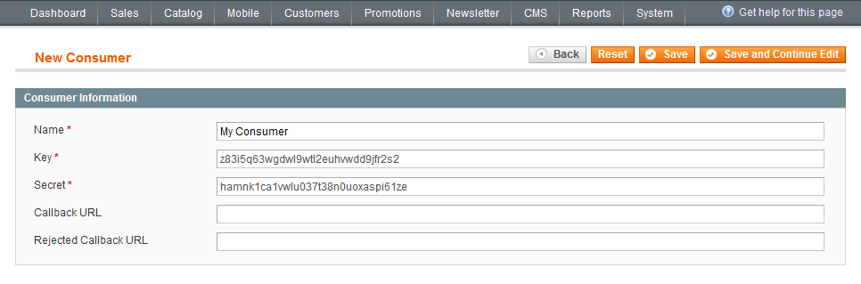
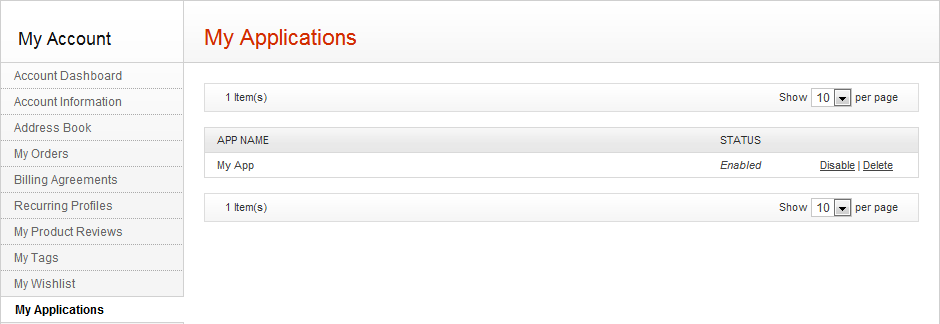
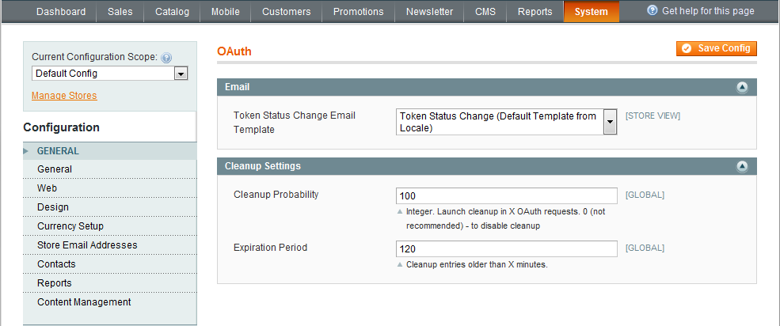

# REST API — Authentication (OAuth 1.0a)

> OAuth authentication flow with PHP examples and OAuth consumer/admin configuration.

---

## Authentication (oauth_authentication)

*Source: <https://devdocs-openmage.org/guides/m1x/api/rest/authentication/oauth_authentication.html>*

### Introduction

In most cases, the third-party application must be authenticated to use the Magento API. But users never reveal their credentials to the application to preserve their privacy. So, the question is as follows: how is your application going to authenticate users if it does not know user credentials. OAuth is the solution.

Magento authentication is based on OAuth, an open standard for secure API authentication. OAuth is a token-passing mechanism that allows users to control which applications have access to their data without revealing their passwords or other credentials.

The OAuth concept lies in three basic elements that can be easily described in the following picture:


To learn more about OAuth, you can visit the official [OAuth](http://oauth.net/) site.

### Using OAuth

The current API supports OAuth 1.0a.

The OAuth authentication works by asking the user to authorize their application. When the user authorizes the application, the application can access that user protected resources by using an access token. This token will be used in each further request. Access tokens are long-lived and will not expire unless the user revokes access to the application.

OAuth is completely invisible for the site visitors.

### Why Do You Need OAuth?

Magento uses OAuth to allow access to its data. You need to use OAuth if you want to use any of the following Magento APIs:

- Products
- Inventory
- Orders
- Customers
- Customer Addresses
- Categories\
  and a lot more

### OAuth Definitions

There are some definitions you need to get familiar with before you start using OAuth. These are as follows:

- **User** - A customer who has an account with Magento and can use the services via the Magento API.
- **Consumer** - A third-party application that uses OAuth to access the Magento API. This application must be registered in the Magento system to receive the Consumer Key and Consumer Secret.
- **Consumer Key** - A value used by the Consumer to identify itself with Magento.
- **Consumer Secret** - A secret used by the Consumer to guarantee the ownership of the Consumer Key. This value is not passed in requests.
- **Request Token** - A value used by the Consumer to obtain authorization from the User (when needed). The Request Token is exchanged for an Access Token when permission is granted.
- **Access Token** - A value used by the Consumer to call Magento APIs on behalf of the User.

### OAuth Process

The OAuth process consists of several steps:

- Getting an Unauthorized Request Token.
- Requesting user authorization.
- Getting an Access Token by exchanging the Request Token for it.


The application that requires access to data is known as the Consumer and Magento is the Service Provider.

#### Registering an Application

Before starting to make API requests, you need to register the application. After the registration, you will receive the Consumer Key that will identify you in Magento. Also, you will receive a Consumer Secret. This secret will be used when requesting for a Request Token.

You can register your application by selecting **System** \> **Web Services** \> **REST - OAuth Consumers** and clicking **Add New** in the Admin Panel.

When registering the application, you also need to define the callback URL, to which the user will be redirected after he/she successfully authorizes your application.

#### Authentication Endpoints

The authentication endpoints include the following ones:

- **/oauth/initiate** - this endpoint is used for retrieving the Request Token.
- **/oauth/authorize** - this endpoint is used for user authorization (Customer).
- **/admin/oauth_authorize** - this endpoint is used for user authorization (Admin).
- **/oauth/token** - this endpoint is used for retrieving the Access Token.

Also, the simple form can be used for authentication. To use a simple form, add the /simple endpoint to the authentication endpoint. For example: /oauth/authorize/simple

##### Getting an Unauthorized Request Token

The first step to authenticate the user is to retrieve a Request Token from Magento. This is a temporary token that will be exchanged for the Access Token.

| **Endpoint**: | /oauth/initiate |
|----|----|
| **Description**: | The first step of authentication. Allows you to obtain the Request Token used for the rest of the authentication process. |
| **Method**: | POST |
| **Returns**: | Request Token |
| **Sample Response**: | oauth_token=4cqw0r7vo0s5goyyqnjb72sqj3vxwr0h&oauth_token_secret=rig3x3j5a9z5j6d4ubjwyf9f1l21itrr&oauth_callback_confirmed=true |

The following request parameters should be present in the Authorization header:

- oauth_callback - an URI to which the Service Provider will redirect the resource owner (user) after the authorization is complete.
- oauth_consumer_key - the Consumer Key value, retrieved after the registration of the application.
- oauth_nonce - a random value, uniquely generated by the application.
- oauth_signature_method - name of the signature method used to sign the request. Can have one of the following values: HMAC-SHA1, RSA-SHA1, and PLAINTEXT.
- oauth_signature - a generated value (signature).
- oauth_timestamp - a positive integer, expressed in the number of seconds since January 1, 1970 00:00:00 GMT.
- oauth_version - OAuth version.

##### User Authorization

The second step is to request user authorization. After receiving the Request Token from Magento, the application provides an authorization page to the user. The only required parameter for this step is the Request Token (oauth_token value) received from the previous step. The endpoint is followed by an oauth_token parameter with the value set to the oauth_token value.

After this, the user is asked to enter their credentials and authorize. When the user is granted the access, he/she is redirected to the URL specified in the oauth_callback parameter. This URL is followed by two parameters:

- oauth_token - the Request Token value.
- oauth_verifier - a verification code that is tied to the Request Token.

| **Endpoint**: | /oauth/authorize |
|----|----|
| **Description**: | The second step of authentication. Without the user authorization in this step, it is impossible for your application to obtain an Access Token. |
| **Method**: | GET |
| **Sample Response**: | /callback?oauth_token=tz2kmxyf3lagl3o95xnox9ia15k6mpt3&oauth_verifier=cbwwh03alr5huiz5c76wi4l21zf05eb0 |

##### Getting an Access Token

The final third authentication step. After the application access is authorized, the application needs to exchange the Request Token for an Access Token. For this step, you will need the Request Token (the oauth_token and oauth_token_secret values) and the oauth_verifier value from the previous step.

| **Endpoint**: | /oauth/token |
|----|----|
| **Description**: | The third step of authentication. Getting an Access Token. |
| **Method**: | POST |
| **Returns**: | An access token and the corresponding access token secret, URL-encoded. |
| **Sample Response**: | oauth_token=0lnuajnuzeei2o8xcddii5us77xnb6v0&oauth_token_secret=1c6d2hycnir5ygf39fycs6zhtaagx8pd |

The following components should be present in the Authorization header:

- oauth_consumer_key - the Consumer Key value provided after the registration of the application.
- oauth_nonce - a random value, uniquely generated by the application.
- oauth_signature_method - name of the signature method used to sign the request. Can have one of the following values: HMAC-SHA1, RSA-SHA1, and PLAINTEXT.
- oauth_signature - a generated value (signature).
- oauth_timestamp - a positive integer, expressed in the number of seconds since January 1, 1970 00:00:00 GMT.
- oauth_token - the oauth_token value (Request Token) received from the previous steps.
- oauth_verifier - the verification code that is tied to the Request Token.
- oauth_version - OAuth version.

The response will contain the following response parameters:

- oauth_token - the Access Token that provides access to protected resources.
- oauth_token_secret - the secret that is associated with the Access Token.

### OAuth Error Codes

When the third-party application performs invalid requests to Magento, the following errors related to OAuth can occur:

| HTTP Code | Error Code | Text Representation | Description |
|----|----|----|----|
| 400 | 1 | version_rejected | This error is used when the oauth_version parameter does not correspond to the "1.0a" value. |
| 400 | 2 | parameter_absent | This error is used there is no required parameter in the request. The name of the missing parameter is specified additionally in the response. |
| 400 | 3 | parameter_rejected | This error is used when the type of the parameter or its value does not meet the protocol requirements (e.g., array is passed instead of the string). |
| 400 | 4 | timestamp_refused | This error is used if there is incorrect value of the timestamp in the oauth_timestamp parameter. |
| 401 | 5 | nonce_used | This error is used if the nonce-timestamp combination has already been used. |
| 400 | 6 | signature_method_rejected | This error is used for unsupported signature method. The following methods are supported: HMAC-SHA1, RSA-SHA1, and PLAINTEXT. |
| 401 | 7 | signature_invalid | This error is used if the signature is invalid. |
| 401 | 8 | consumer_key_rejected | This error is used if the Consumer Key has incorrect length or does not exist. |
| 401 | 9 | token_used | This error is used if there is an attempt of authorization of an already authorized token or an attempt to exchange a not temporary token for a permanent one. |
| 401 | 10 | token_expired | This error is used if the temporary token has expired. At the moment, the mechanism of expiration of temporary tokens is not implemented and the current error is not used. |
| 401 | 11 | token_revoked | This error is used if the token is revoked by the user who authorized it. |
| 401 | 12 | token_rejected | This error is used if the token is not valid, or does not exist, or is not valid for using in the current type of request. |
| 401 | 13 | verifier_invalid | This error is used if the confirmation string does not correspond to the token. |

### PHP Examples

#### Retrieve the list of products for Admin user with OAuth authentication



enableDebug(); if (!isset(\$\_GET\['oauth_token'\]) && !\$\_SESSION\['state'\]) { \$requestToken = \$oauthClient-\>getRequestToken(\$temporaryCredentialsRequestUrl); \$\_SESSION\['secret'\] = \$requestToken\['oauth_token_secret'\]; \$\_SESSION\['state'\] = 1; header('Location: ' . \$adminAuthorizationUrl . '?oauth_token=' . \$requestToken\['oauth_token'\]); exit; } else if (\$\_SESSION\['state'\] == 1) { \$oauthClient-\>setToken(\$\_GET\['oauth_token'\], \$\_SESSION\['secret'\]); \$accessToken = \$oauthClient-\>getAccessToken(\$accessTokenRequestUrl); \$\_SESSION\['state'\] = 2; \$\_SESSION\['token'\] = \$accessToken\['oauth_token'\]; \$\_SESSION\['secret'\] = \$accessToken\['oauth_token_secret'\]; header('Location: ' . \$callbackUrl); exit; } else { \$oauthClient-\>setToken(\$\_SESSION\['token'\], \$\_SESSION\['secret'\]); \$resourceUrl = "\$apiUrl/products"; \$oauthClient-\>fetch(\$resourceUrl, array(), 'GET', array('Content-Type' =\> 'application/json')); \$productsList = json_decode(\$oauthClient-\>getLastResponse()); print_r(\$productsList); } } catch (OAuthException \$e) { print_r(\$e-\>getMessage()); echo "\<br/\>"; print_r(\$e-\>lastResponse); } 

#### Retrieve the list of products for Customer user with OAuth authentication
```php
<?php
/**
 * Example of retrieving the products list using Customer account via Magento REST API. OAuth authorization is used
 * Preconditions:
 * 1. Install php oauth extension
 * 2. If you were authorized as an Admin before this step, clear browser cookies for 'yourhost'
 * 3. Create at least one product in Magento and enable it for viewing in the frontend
 * 4. Configure resource permissions for Customer REST user for retrieving all product data for Customer
 * 5. Create a Consumer
 */
// $callbackUrl is a path to your file with OAuth authentication example for the Customer user
$callbackUrl = "http://yourhost/oauth_customer.php";
$temporaryCredentialsRequestUrl = "http://yourhost/oauth/initiate?oauth_callback=" . urlencode($callbackUrl);
$customerAuthorizationUrl = 'http://yourhost/oauth/authorize';
$accessTokenRequestUrl = 'http://yourhost/oauth/token';
$apiUrl = 'http://yourhost/api/rest';
$consumerKey = 'yourconsumerkey';
$consumerSecret = 'yourconsumersecret';

session_start();
if (!isset($_GET['oauth_token']) && isset($_SESSION['state']) && $_SESSION['state'] == 1) {
    $_SESSION['state'] = 0;
}
try {
    $authType = ($_SESSION['state'] == 2) ? OAUTH_AUTH_TYPE_AUTHORIZATION : OAUTH_AUTH_TYPE_URI;
    $oauthClient = new OAuth($consumerKey, $consumerSecret, OAUTH_SIG_METHOD_HMACSHA1, $authType);
    $oauthClient->enableDebug();

    if (!isset($_GET['oauth_token']) && !$_SESSION['state']) {
        $requestToken = $oauthClient->getRequestToken($temporaryCredentialsRequestUrl);
        $_SESSION['secret'] = $requestToken['oauth_token_secret'];
        $_SESSION['state'] = 1;
        header('Location: ' . $customerAuthorizationUrl . '?oauth_token=' . $requestToken['oauth_token']);
        exit;
    } else if ($_SESSION['state'] == 1) {
        $oauthClient->setToken($_GET['oauth_token'], $_SESSION['secret']);
        $accessToken = $oauthClient->getAccessToken($accessTokenRequestUrl);
        $_SESSION['state'] = 2;
        $_SESSION['token'] = $accessToken['oauth_token'];
        $_SESSION['secret'] = $accessToken['oauth_token_secret'];
        header('Location: ' . $callbackUrl);
        exit;
    } else {
        $oauthClient->setToken($_SESSION['token'], $_SESSION['secret']);

        $resourceUrl = "$apiUrl/products";
        $oauthClient->fetch($resourceUrl, array(), 'GET', array('Content-Type' => 'application/json'));
        $productsList = json_decode($oauthClient->getLastResponse());
        print_r($productsList);
    }
} catch (OAuthException $e) {
    print_r($e->getMessage());
    echo "<br/>";
    print_r($e->lastResponse);
}
```

---

## OAuth Configuration (oauth_configuration)

*Source: <https://devdocs-openmage.org/guides/m1x/api/rest/authentication/oauth_configuration.html>*

### Working with Consumers

#### Adding a New Consumer

First, you need to create a Consumer in the Admin Panel. Creating a new consumer means registering the application. To do this, perform the following steps:

1.  On the Magento Admin Panel menu, select **System** \> **Web Services** \> **REST - OAuth Consumers**.
2.  On the OAuth Consumers page, click **Add New** in the top right corner to add a new consumer.
3.  The New Consumer page opens. The **Key** and **Secret** fields are filled automatically and cannot be edited. These values are generated automatically and will be used to identify the Consumer in Magento.\
    
4.  Fill in the following fields:
    - **Name**: Enter the name of the application to be registered. This field is required.
    - **Callback URL**: Enter the URL address to which the Consumer will be redirected after the authorization is passed successfully. This URL address implies the path to the application. This field is optional.
    - **Rejected Callback URL**: Enter the URL address to which the user will be redirected if he/she rejects authorization. This field is optional.
5.  Click **Save** in the top right corner to save the created Consumer.

#### Editing an Existing Consumer

To edit an existing consumer, perform the following steps:

1.  On the Magento Admin Panel menu, select **System** \> **Web Services** \> **REST - OAuth Consumers**.
2.  The OAuth Consumers page opens. In the grid, select the consumer to be edited and click it.
3.  The Edit Consumer page opens. On this page, you can edit the following fields:
    - **Name**: Enter a new name for the application.
    - **Callback URL**: Enter a new URL address to which the user will be redirected after successful authorization. This URL address implies the path to the application.
    - **Rejected Callback URL**: Enter another URL address to which the user will be redirected after he/she rejects authorization proceeding.
      |                                                     |
      |-----------------------------------------------------|
      | The **Key** and **Secret** fields cannot be edited. |
4.  Click **Save** in the top right corner to save changes.

#### Deleting an Existing Consumer

To delete the required consumer, perform the following steps:

1.  On the Magento Admin Panel menu, select **System** \> **Web Services** \> **REST - OAuth Consumers**.
2.  The OAuth Consumers page opens. In the grid, select the consumer to be deleted and click it.
3.  The Edit Consumer page opens. Click **Delete** in the top right corner to delete the selected consumer.

#### Searching for a Consumer

You can search for a required consumer by several parameters: ID, consumer name, and date of creation.\
To search for a consumer, perform the following steps:

1.  On the Magento Admin Panel menu, select **System** \> **Web Services** \> **REST - OAuth Consumers**.
2.  The OAuth Consumers page opens. The list of consumers is displayed in a grid with the following fields: ID, Consumer Name, and Created At.
3.  In the search field below the column header in a grid, enter the required value by which the search will be performed. Click **Search** in the top right corner.

### Working with Tokens (Admin Panel)

#### Viewing Authorized Tokens

To view authorized tokens in the Admin panel, perform the following steps:

1.  On the Magento Admin Panel menu, select **System** \> **Web Services** \> **REST - OAuth Authorized Tokens**.
2.  The Authorized OAuth Tokens page opens. In the grid, the list of all authorized tokens is displayed.
3.  Tokens are displayed in the grid with the following columns: ID, Application Name (name of consumer for which the token is created), User Type (type of the user, Customer or Admin), User ID, and the Revoked status.

From the Authorized OAuth Tokens page, you can enable, revoke, or delete the required token.

#### Viewing Applications

To view the list of applications, perform the following steps:

1.  On the Magento Admin Panel menu, select **System** \> **Web Services** \> **REST - My Apps**.
2.  The My Applications page opens. Registered applications are displayed in a grid with the following columns: ID, Application Name, and Revoked.

#### Enabling Tokens

If a token is revoked (the Yes value in the Revoked column on the Authorized OAuth Tokens page), you can enable it. To do this, perform the following steps:

1.  In the Authorized OAuth Tokens grid, select the token with the **Revoked** status set to Yes and select the checkbox next to it.
    |  |
    |----|
    | You can select more than one token with the **Revoked** status and enable all of them by using the mass action. |
2.  In the **Actions** drop-down list, select the **Enable** option and click **Submit**.
3.  The required token is enabled.

#### Revoking Tokens

If a token is enabled (the No value in the Revoked column), you can revoke it. To do this, perform the following steps:

1.  In the Authorized OAuth Tokens grid, select the token with the **Revoked** status set to No and select the checkbox next to it.
    |  |
    |----|
    | You can select more than one token with the **Revoked** status set to No and revoke all of them by using the mass action. |
2.  In the **Actions** drop-down list, select the **Revoke** option and click **Submit**.
3.  The required token is revoked.

#### Deleting Tokens

To delete the required token, perform the following steps:

1.  In the Authorized OAuth Tokens grid, select the token to be deleted and select the checkbox next to it.
    |  |
    |----|
    | You can select more than one token and delete all of them by using the mass action. |
2.  In the **Actions** drop-down list, select the **Delete** option and click **Submit**.
3.  The required token is deleted.

### Working with Tokens (Frontend)

#### Viewing Applications

To view the authorized applications from the frontend, perform the following steps:

1.  On the frontend, click **My Account** and then select the **My Applications** tab on the left.
2.  On the My Applications page, the list of registered applications will be displayed.\
    

From this page, you can enable, revoke, or delete the required token.

#### Enabling Tokens

1.  In the list of consumers, select the consumer to be enabled.
    |  |
    |----|
    | If the token is revoked, there will be the **Disabled** status next to it. |
2.  Click **Enable** next to the consumer name.
3.  The token is enabled.

#### Disabling Tokens

1.  In the list of consumers, select the consumer to be disabled.
    |  |
    |----|
    | If the token is enabled, there will be the **Enabled** status next to it. |
2.  Click **Disable** next to the consumer name.
3.  The token is disabled.

#### Deleting Tokens

1.  In the list of consumers, select the consumer to be deleted.
2.  Click **Delete** next to the consumer name.
3.  The token is deleted.

### Working with Email Templates

#### Setting Up the Default Email Template

You can set the email template that will be used for user notification if the token status changes. Also, you can set different email templates for different store views. For example, you have two store views: English and German. Magento allows you to set one email template for the English store view and another one for the German store view.\
To set the email template, perform the following steps:

1.  On the Admin Panel menu, select **System** \> **Configuration**.
2.  Select **Services** \> **OAuth** on the left.\
    
3.  In the **Email** panel, from the **Token Status Change Email Template** drop-down list, select the required template and click **Save Config** in the top right corner.
4.  The template is saved.

#### Creating a New Email Template

You can also create your own email template that will be used for user notification if the token status changes.\
To create a new template, perform the following steps:

1.  On the Admin Panel menu, select **System** \> **Transactional Emails**.
2.  The Transactional Emails page opens. Click **Add New Template** in the top right corner.
3.  The New Email template page opens. In the Load default template panel, in the **Template** drop-down list, select the **Token Status Change** option.
4.  Specify the **Locale** option and click **Load Template**.
5.  In the Template Information panel, the template data is loaded. You can specify your own template name, subject, and content.
6.  When the email template is created, click **Save Template** in the top right corner.
7.  Set the newly created template as it was described above.

### Cleanup Configuration

You can configure the cleanup functionality for temporary tokens. These tokens can be deleted after a certain period of time or after a certain number of OAuth requests.\
To configure cleanup, perform the following steps:

1.  On the Admin Panel menu, select **System** \> **Configuration**.
2.  Select **Services** \> **OAuth** on the left.\
    
3.  In the **Cleanup Statistics** panel, you can set the following values:
    - **Cleanup Probability**: Define the threshold of OAuth requests after which the cleanup will be performed. Only temporary credentials will be removed. Enter 0 to disable the cleanup.
    - **Expiration Period**: Define the period (in minutes) on the expiry of which entries will be deleted from the database.
4.  Click **Save Config** in the top right corner to save changes.

---
