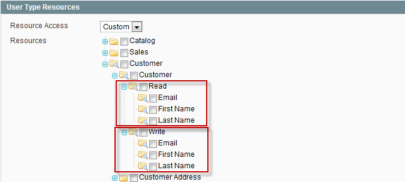
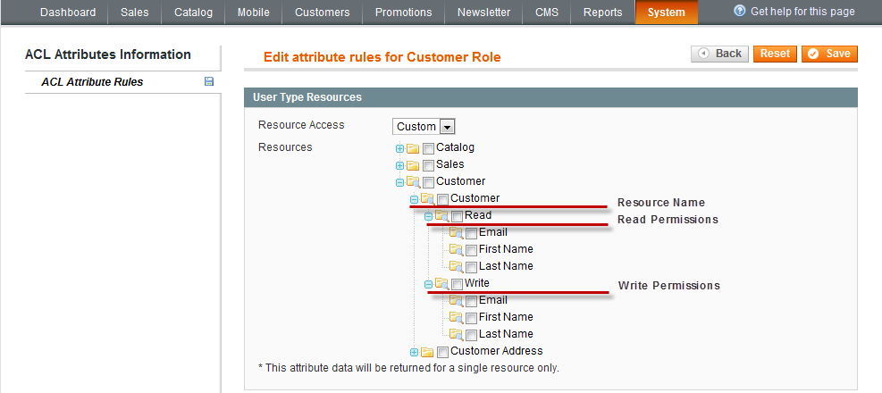

# REST API — Permission Settings, Roles & Attributes

> Admin panel configuration of REST roles, resource permissions and attribute access.

---

## Permission Settings (permission_settings)

*Source: <https://devdocs-openmage.org/guides/m1x/api/rest/permission_settings/permission_settings.html>*

#### Introduction

After the authentication is complete successfully, the Access Token is received and will be used in every API call. This key allows identifying the client that accesses the API. With the help of this key, the following information about the user can be retrieved:

- Type of the API user
- User ID (can be Admin ID or Customer ID)

#### Authorization

##### Access Levels

There is a three-level authorization approach in Magento REST API. These three levels are as follows:

- Guest
- Customer
- Admin

The following graphic describes the default rights for each access level with each level obtaining more rights up to Admin who has access to everything.

Each user type will be described below.\
Magento grants permissions for the following three types of users:

**Guest**

Guest can be a type of application that does not require authentication. This application has access only to public resources.

**Customer**

Customer can be a registered and logged in user. This type of user can have access only to its own resources as well as to public resources.

**Admin**

Admin can be the store owner. This type has full set of permissions.

Understanding of access levels is the basis of the ACL work.

##### Access Control List (ACL)

###### ACL Overview

Every user has a specific role and purpose. To accomplish their goals, each user must be able to access certain resources and perform specific actions. Allowing users to access the resources without any limits can compromise Magento security.

The Access Control List (ACL) is a set of permissions (access rights) that particular users have for certain resources. When a user wants to perform a specific action with a resource (for example, update the customer information), Magento checks the permission for this combination of user, resource, and action. If the action is allowed, the user can proceed. Otherwise, the action is denied.

###### Understanding ACL

Access control lists include two main things: a subject and an object. Usually, the subject is the user who wants to use the resource. The object is the resource that a certain user wants to have access to. So, ACL is used to decide when the subject can have access to object.

You should remember that ACL is not the same as authentication. ACL is the next step after the authentication is passed successfully. These two concepts are closely connected but the difference lies in the following: authentication is understanding who the user is and ACL is understanding what the user can do.

###### ACL Structure

ACL is implemented in a tree structure. There is a tree of resources for each user type. Namely, Admin, Customer, and Guest have their own trees of resources.\
Each ACL entry specifies two instances: a subject and an action the subject can perform.

Example of the resource tree for the Admin role is as follows:\

###### Read/Write Permissions

All REST resource attributes are divided into two categories: Read and Write. The Read category includes the operation of retrieving. So, when selecting the attributes in the Read category, you specify them for the resource retrieving. The Write category includes the operations of creating and updating. So, when selecting the attributes in the Write category, you specify them for the resource creation and updating. To illustrate the situation, let's take the following example:\

##### Setting Up ACL

Setting up ACL is performed on two levels:

- Setting up REST roles
- Setting up REST attributes

\

---

## Roles Configuration (roles_configuration)

*Source: <https://devdocs-openmage.org/guides/m1x/api/rest/permission_settings/roles_configuration.html>*

#### Viewing REST Roles

To view the list of REST roles, perform the following steps:

1.  On the Magento Admin Panel menu, select **System** \> **Web Services** \> **REST - Roles**.
2.  The REST Roles page opens.
3.  REST roles are displayed in a grid with the following columns: ID (role ID), Role Name, User Type, and Created At (date and time of the role creation).

#### Working with Admin Role

##### Adding a New REST Role for Admin

To add a new REST role for Admin, perform the following steps:

1.  On the Magento Admin Panel menu, select **System** \> **Web Services** \> **REST - Roles**.
2.  The REST Roles page opens.
3.  In the top right corner, click **Add Admin Role**. The Add New Role page opens.
4.  There are two tabs in the Role Information panel on the left: Role Info and Role API Resources.
5.  Select the Role Info tab and in the Role Information panel, enter the name for the role to be created in the corresponding **Role Name** field. This field is required.
6.  In the Role API Resources tab, in the **Resource Access** drop-down list, select whether the user will have full or custom access by selecting the corresponding **All** or **Custom** options. If you select the **Custom** option, the Resources tree will appear where you will be able to check the required resources and actions.
7.  Click **Save Role** in the top right corner to save the role.
8.  After you saved the role, a new Role Users tab appears in the Role Information panel on the left. In this tab, you can manage users for the current role. Click **Reset Filter** to view all users to which the role can be assigned.

##### Editing an Existing Admin REST Role

To edit an existing Admin REST role, perform the following steps:

1.  On the Magento Admin Panel menu, select **System** \> **Web Services** \> **REST - Roles**.
2.  The REST Roles page opens. In the roles grid, select the Admin role and click it.
3.  The Edit Role \<role name\> page opens. You can edit the following information:
    - **Role Info**: Edit the name of the Admin role by selecting the Role Info tab to the left.
    - **Role API Resources**: Select or clear the resources available for this role.
    - **Role Users**: Assign or remove users for this role.
4.  Click **Save Role** in the top right corner to apply changes.

##### Deleting an Existing Admin REST Role

To delete an existing Admin REST role, perform the following steps:

1.  On the Magento Admin Panel menu, select **System** \> **Web Services** \> **REST - Roles**.
2.  The REST Roles page opens. In the roles grid, select the required Admin role to be deleted and click it.
3.  The Edit Role \<role name\> page opens. In the top right corner, click **Delete Role**. The role is deleted.

##### Assigning a REST Role to Admin

To assign a REST role to admin, perform the following steps:

1.  On the Magento Admin Panel menu, select **System** \> **Permissions** \> **Users**.
2.  The Users page opens. In the users grid, select the user to which the REST Admin role will be assigned.
3.  The Edit User \<Name of the User\> page opens. In the User Information panel, select the REST Role tab.
4.  In the list of REST roles, select the Admin role to be assigned and select the option button next to it.
5.  Click **Save User** in the top right corner to save changes.

##### Assigning Multiple Users to an Admin REST Role

To assign more than one user to an existing Admin REST role, perform the following steps:

1.  On the Magento Admin Panel menu, select **System** \> **Web Services** \> **REST - Roles**.
2.  The REST Roles page opens. In the REST roles grid, select the Admin role to which users will be assigned.
3.  The Edit Role \<role name\> page opens. In the Role Information panel, select the Role Users tab.
4.  In the list of users, click **Reset Filter** to view the list of all users to which the role can be assigned. Select the checkboxes near the users to be assigned to the Admin role.
5.  Click **Save Role** in the top right corner to save changes.

##### Viewing Users Assigned to an Admin REST Role

To view the list of users assigned to a REST role, perform the following steps:

1.  On the Magento Admin Panel menu, select **System** \> **Web Services** \> **REST - Roles**.
2.  The REST Roles page opens. From the list of roles, select the Admin role whose assigned users you want to view and click it.
3.  The Edit Role \<role name\> page opens. In the Role Information panel on the left, select the Role Users tab.
4.  The list of REST role users is displayed in a grid with the following columns: ID, User Name, First Name, and Last Name.

##### Unassigning User from the Admin REST Role

To unassign the Admin REST role from a user, perform the following steps:

1.  On the Magento Admin Panel menu, select **System** \> **Web Services** \> **REST - Roles**.
2.  The REST Roles page opens. From the list of roles, select the Admin role from which you want to unassign a user and click it.
3.  The Edit Role \<role name\> page opens. In the Role Information panel on the left, select the Role Users tab.
4.  Clear the checkbox next to the user which you want to unassign from the current REST role.
5.  Click **Save Role** in the top right corner to apply the changes.

#### Working with Guest and Customer Roles

As it has been mentioned before, the Customer and Guest roles cannot be removed and can be only partially edited. You can edit only the resources and actions allowed for the user.

##### Editing the Guest REST Role

To edit the Guest REST role, perform the following steps:

1.  On the Magento Admin Panel menu, select **System** \> **Web Services** \> **REST - Roles**.
2.  The REST Roles page opens. From the list of roles, select the Guest role and click it.
3.  The Edit Role "Guest" page opens. In the Role Resources panel, edit the required information.
4.  Click **Save Role** in the top right corner to apply changes.

##### Editing the Customer REST Role

To edit the Customer REST role, perform the following steps:

1.  On the Magento Admin Panel menu, select **System** \> **Web Services** \> **REST - Roles**.
2.  The REST Roles page opens. From the list of roles, select the Customer role and click it.
3.  The Edit Role "Customer" page opens. In the Role Resources panel, edit the required information.
4.  Click **Save Role** in the top right corner to apply changes.

\

---

## Attributes Configuration (attributes_configuration)

*Source: <https://devdocs-openmage.org/guides/m1x/api/rest/permission_settings/attributes_configuration.html>*

#### REST Attributes Structure

The REST attributes tree includes the following elements (as subnodes):

- Name of the resource
  - Read permissions (includes all elements available for the current resource)
  - Write permissions (includes all elements available for the current resource)

The Resources tree may be too immense. To avoid scrolling down when searching for the required resource, you can fold the nodes for better representation.

#### Managing Attributes for Guest

1.  On the Magento Admin Panel menu, select **System** \> **Web Services** \> **REST - Attributes**.
2.  The REST Attributes page opens. From the list of user types, select the **Guest** type and click it.
3.  The page for editing attribute rules opens.
4.  In the User Type Resources panel, in the **Resource Access** drop-down list, select whether all or some specific resources will be limited to a **Guest** type of user by selecting the corresponding **All** or **Custom** options.
5.  If you select the **Custom** option, the resources tree appears.
6.  Select the required options and click **Save** in the top right corner to apply changes.

#### Managing Attributes for Customer

1.  On the Magento Admin Panel menu, select **System** \> **Web Services** \> **REST - Attributes**.
2.  The REST Attributes page opens. From the list of user types, select the **Customer** type and click it.
3.  The page for editing attribute rules opens.
4.  In the User Type Resources panel, in the **Resource Access** drop-down list, select whether all or some specific resources will be limited to a **Customer** type of user by selecting the corresponding **All** or **Custom** options.
5.  If you select the **Custom** option, the resources tree appears. Some resources have options for selecting read and write permissions.
6.  Select the required options and click **Save** in the top right corner to apply changes.

#### Managing Attributes for Admin

1.  On the Magento Admin Panel menu, select **System** \> **Web Services** \> **REST - Attributes**.
2.  The REST Attributes page opens. From the list of user types, select the **Admin** type and click it.
3.  The page for editing attribute rules opens.
4.  In the User Type Resources panel, in the **Resource Access** drop-down list, select whether all or some specific resources will be limited to an **Admin** type of user by selecting the corresponding **All** or **Custom** options.
5.  If you select the **Custom** option, the resources tree appears. Each resource has options for selecting read and write permissions.
6.  Select the required options and click **Save** in the top right corner to apply changes.

#### Examples

This section provides some examples of limiting Guest and Customer access to certain resource elements.

##### Limiting Guest Access to Products

To allow Guests (users that are not registered in the Magento system) view only product name and final price with tax, perform the following steps:

1.  On the Magento Admin Panel menu, select **System** \> **Web Services** \> **REST - Roles** and select the Guest role.
2.  In the **Role API Resources**, specify the Retrieve option for the Product resource.
3.  Click **Save Role** on the top right corner to save the role.
4.  On the Magento Admin Panel menu, select **System** \> **Web Services** \> **REST - Attributes** and select **Guest** in the list of User Types.
5.  In the Resources tree, navigate to the **Catalog Product** node. In the Read subnode, select the **Name** and **Final Price With Tax** options.
6.  Click **Save** in the top right corner to save the selected attributes.

##### Limiting Customer Access to Products

To allow Customers (users that are registered in the Magento system) view only product name and final price with tax, perform the following steps:

1.  On the Magento Admin Panel menu, select **System** \> **Web Services** \> **REST - Roles** and select the Customer role.
2.  In the **Role API Resources**, specify the Retrieve option for the Product resource.
3.  Click **Save Role** on the top right corner to save the role.
4.  On the Magento Admin Panel menu, select **System** \> **Web Services** \> **REST - Attributes** and select **Customer** in the list of User Types.
5.  In the Resources tree, navigate to the **Catalog Product** node. In the Read subnode, select the **Name** and **Final Price With Tax** options.
6.  Click **Save** in the top right corner to save the selected attributes.

\

---

## Attributes Description (attributes_description)

*Source: <https://devdocs-openmage.org/guides/m1x/api/rest/permission_settings/attributes_description.html>*

#### Order/Orders

| Attribute Name | Attribute Description | Notes |
|----|----|----|
| Order ID | Sales order ID |   |
| Order Date | Date when the sales order was placed |   |
| Order Status | Sales order status. Can have the following values: Pending, Processing, Complete, Closed, Holded, Pending PayPal, and Payment Review. |   |
| Shipping Method | Shipping method selected during the checkout process (e.g., Flat rate - Fixed) |   |
| Payment Method | Payment method selected during the checkout process (e.g., Check/money order) |   |
| Base Currency | Base currency code (e.g., USD) |   |
| Order Currency | Order currency code (e.g., EUR) |   |
| Store Name | Name of the store from which the order was placed |   |
| Placed from IP | IP address from which the order was placed |   |
| Store Currency to Base Currency Rate | Store currency to base currency rate |   |
| Subtotal | Subtotal amount in order currency (excluding shipping and tax) |   |
| Subtotal Including Tax | Subtotal amount including tax (in order currency) |   |
| Discount | Discount amount applied in the sales order in order currency |   |
| Grand Total to Be Charged | Total amount of money to be paid for the order in base currency (including tax) |   |
| Grand Total | Grand total amount in order currency (including tax and shipping) |   |
| Shipping | Shipping amount applied in the sales order in order currency |   |
| Shipping Including Tax | Shipping amount including tax (in order currency) |   |
| Shipping Tax | Tax amount for shipping in order currency |   |
| Tax Amount | Tax amount applied in the sales order in order currency |   |
| Tax Name | Name of the applied tax |   |
| Tax Rate | Tax rate applied in the order (in order currency) |   |
| Gift Cards Amount | Gift card pricing amount | This attribute is available only in Magento EE |
| Reward Points Balance | Reward points amount (that can be converted to currency) | This attribute is available only in Magento EE |
| Reward Currency Amount | Reward currency amount | This attribute is available only in Magento EE |
| Coupon Code | Coupon code that was applied in the order |   |
| Base Discount | Amount of applied discount in base currency |   |
| Base Subtotal | Subtotal amount for all products in the order in base currency (excluding tax and shipping) |   |
| Base Shipping | Amount of money to be paid for shipping in base currency |   |
| Base Shipping Tax | Tax amount for shipping in base currency |   |
| Base Tax Amount | Tax amount applied to the order items in base currency |   |
| Total Paid | Total amount paid for the order (in order currency) |   |
| Base Total Paid | Total amount paid for the order (in base currency) |   |
| Total Refunded | Total refunded amount in order currency |   |
| Base Total Refunded | Total amount refunded for the order (in base currency) |   |
| Base Subtotal Including Tax | Subtotal amount including tax but excluding the discount amount (in base currency) |   |
| Base Total Due | The rest of the money to be paid for the order in base currency (e.g., when partial invoice is applied) |   |
| Total Due | The rest of the money to be paid for the order in order currency (e.g., when partial invoice is applied) |   |
| Shipping Discount | Discount amount for shipping (in order currency) |   |
| Base Shipping Discount | Discount amount for shipping (in base currency) |   |
| Discount Description | Discount code (coupon code applied in the order) |   |
| Customer Balance | Customer balance (in order currency) |   |
| Base Customer Balance | Customer balance (in base currency) |   |
| Base Gift Cards Amount | Gift card pricing amount (in base currency) | This attribute is available only in Magento EE |
| Base Rewards Currency | Reward currency amount (in base currency) | This attribute is available only in Magento EE |

##### Order Addresses

| Attribute Name | Attribute Description |
|----|----|
| Customer Last Name | Customer last name |
| Customer First Name | Customer first name |
| Customer Middle Name | Customer middle name or initial |
| Customer Prefix | Customer prefix |
| Customer Suffix | Customer suffix |
| Company | Company name |
| Street | Street address |
| City | City |
| State | State |
| ZIP/Postal Code | ZIP or postal code |
| Country | Country name |
| Phone Number | Customer phone number |
| Address Type | Address type. Can have the following values: billing or shipping |

##### Order Items

| Attribute Name | Attribute Description |
|----|----|
| Base Discount Amount | Discount amount applied to the row in base currency |
| Base Item Subtotal | Row subtotal in base currency |
| Base Item Subtotal Including tax | Row subtotal including tax in base currency |
| Base Original Price | Original item price in base currency |
| Base Price | Item price in base currency |
| Base Price Including tax | Item price including tax in base currency |
| Base Tax Amount | Tax amount applied to the row in base currency |
| Canceled Qty | Number of canceled order items |
| Discount Amount | Discount amount applied to the row in order currency |
| Invoiced Qty | Number of invoiced order items |
| Item Subtotal | Row subtotal in order currency |
| Item Subtotal Including Tax | Row subtotal including tax in order currency |
| Order Item ID | Order item ID |
| Ordered Qty | Number of ordered items |
| Original Price | Original item price in order currency |
| Parent Order Item ID | ID of the configurable product to which the simple product is assigned |
| Price | Item price in order currency |
| Price Including Tax | Item price including tax in order currency |
| Product and Custom Options Name | Name of the product (custom options name) |
| Refunded Qty | Number of refunded order items |
| SKU | Product SKU |
| Shipped Qty | Number of shipped order items |
| Tax Amount | Tax amount applied to the row in order currency |
| Tax Percent | Tax percent applied to the row |

#### Stock Item

| Attribute Name | Attribute Description |
|----|----|
| Automatically Return Credit Memo Item to Stock | Defines whether products can be automatically returned to stock when the refund for an order is created |
| Backorders | Defines whether the customer can place the order for products that are out of stock at the moment. Can have the following values: 0 - No Backorders, 1 - Allow Qty Below 0, and 2 - Allow Qty Below 0 and Notify Customer |
| Can Be Divided into Multiple Boxes for Shipping | Defines whether the stock items can be divided into multiple boxes for shipping |
| Enable Qty Increments | Defines whether the customer can add products only in increments to the shopping cart |
| Item ID | Stock item ID |
| Low Stock Date | Date when the number of stock items became lower than the number defined in the Notify for Quantity Below option |
| Manage Stock | Choose whether to view and specify the product quantity and availability and whether the product is in stock management. Can have the following values: 0 - No, 1 - Yes |
| Maximum Qty Allowed in Shopping Cart | Maximum number of items in the shopping cart to be sold |
| Minimum Qty Allowed in Shopping Cart | Minimum number of items in the shopping cart to be sold |
| Notify for Quantity Below | The number of inventory items below which the customer will be notified via the RSS feed |
| Product ID | Product ID |
| Qty | Quantity of stock items for the current product |
| Qty Increments | The product quantity increment value |
| Qty Uses Decimals | Choose whether the product can be sold using decimals (e.g., you can buy 2.5 product) |
| Qty for Item's Status to Become Out of Stock | Quantity for stock items to become out of stock |
| Stock Availability | Defines whether the product is available for selling. Can have the following values: 0 - Out of Stock, 1 - In Stock |
| Stock ID | Stock ID |
| Use Config Settings for Backorders | Choose whether the Config settings will be applied for the Backorders option |
| Use Config Settings for Enable Qty Increments | Choose whether the Config settings will be applied for the Enable Qty Increments option |
| Use Config Settings for Manage Stock | Choose whether the Config settings will be applied for the Manage Stock option |
| Use Config Settings for Maximum Qty Allowed in Shopping Cart | Choose whether the Config settings will be applied for the Maximum Qty Allowed in Shopping Cart option |
| Use Config Settings for Minimum Qty Allowed in Shopping Cart | Choose whether the Config settings will be applied for the Minimum Qty Allowed in Shopping Cart option |
| Use Config Settings for Notify for Quantity Below | Choose whether the Config settings will be applied for the Notify for Quantity Below option |
| Use Config Settings for Qty Increments | Choose whether the Config settings will be applied for the Qty Increments option |
| Use Config Settings for Qty for Item's Status to Become Out of Stock | Choose whether the Config settings will be applied for the Qty for Item's Status to Become Out of Stock option |

**Notes**: The Admin user type has restrictions concerning the WRITE operations for definite stock item attributes. These are as follows:

| Attribute Name | Admin |
|----------------|-------|
| Item ID        | No    |
| Product ID     | No    |
| Stock ID       | No    |
| Low Stock Date | No    |

However, these attributes are available for READ operations.

#### Customer

| Attribute Name | Attribute Description |
|----|----|
| Customer ID | Customer ID |
| Last Logged In | Date when the customer was logged in last |
| Is Confirmed | Defines whether the email confirmation is sent to the customer |
| Created At | Date when the customer was created |
| Associate to Website | Website ID to which the customer is associated |
| Created From | Store view from which the customer was created |
| Group | Customer group ID |
| Disable automatic group change | Defines whether the automatic group change will be applied to the customer |
| Prefix | Customer prefix |
| First Name | Customer first name |
| Middle Name/Initial | Customer middle name or initial |
| Last Name | Customer last name |
| Suffix | Customer suffix |
| Email | Customer email address |
| Date Of Birth | Customer date of birth |
| Tax/VAT Number | Customer tax or VAT number |
| Gender | Customer gender (male or female) |

#### Customer Address

| Attribute Name | Attribute Description |
|----|----|
| City | City name |
| Company | Company name |
| Country | Country |
| Customer Address ID | Customer address ID |
| Fax | Fax number |
| First Name | Customer first name |
| Is Default Billing Address | Defines whether the address is a default one for billing |
| Is Default Shipping Address | Defines whether the address is a default one for shipping |
| Last Name | Customer last name |
| Middle Name/Initial | Customer middle name or initial |
| Prefix | Customer prefix |
| State/Province | Customer state/region |
| Street Address | Customer street address |
| Suffix | Customer suffix |
| Telephone | Customer phone number |
| VAT Number | Customer VAT number |
| ZIP/Postal Code | Customer ZIP or postal code |

#### Product

Attributes for the product resource are divided into those available for the Admin type of user and those available for the Customer and Guest types of user.

| Attribute Name | Attribute Description | Notes |
|----|----|----|
| Product ID | Product ID | Available only for Admin |
| name | Product Name |   |
| Product Type | Product type. Can have the following values: Simple, Grouped, Configurable, Virtual, Bundle, or Downloadable |   |
| Attribute Set Name | Name of the attribute set which the product is based on | Available only for Admin |
| sku | Product SKU |   |
| price | Product price |   |
| visibility | Product visibility in the store. Can have the following values: Catalog, Search; Search; Catalog; Not Visible Individually | Available only for Admin |
| description | Product description |   |
| short_description | Product short description |   |
| weight | Product weight | Available only for Admin |
| news_from_date | Date starting from which the product is promoted as a new product | Available only for Admin |
| news_to_date | Date till which the product is promoted as a new product | Available only for Admin |
| status | Product status in the store. Can have the following values: Enabled or Disabled | Available only for Admin |
| url_key | A friendly URL path for the product | Available only for Admin |
| Create Permanent Redirect for Old URL | Defines whether the redirect to an original URL will be applied (when the existing URL for a product is edited) | Available only for Admin; available only for product update |
| country_of_manufacture | Product country of manufacture | Available only for Admin |
| is_returnable | Defines whether the product can be returned | Available only for Admin |
| special_price | Product special price | Available only for Admin |
| special_from_date | Date starting from which the special price will be applied for the product | Available only for Admin |
| special_to_date | Date till which the special price will be applied for the product | Available only for Admin |
| group_price | Product group price | Available only for Admin |
| tier_price | Product tier price |   |
| msrp_enabled | The Apply MAP option. Defines whether the price in the catalog in the frontend is substituted with a Click for price link | Available only for Admin |
| msrp_display_actual_price_type | Defines how the price will be displayed in the frontend. Can have the following values: In Cart, Before Order Confirmation, and On Gesture | Available only for Admin |
| msrp | The Manufacturer's Suggested Retail Price option. The price that a manufacturer suggests to sell the product at | Available only for Admin |
| enable_googlecheckout | Defines whether the product can be purchased with the help of the Google Checkout payment service. Can have the following values: Yes and No | Available only for Admin |
| tax_class_id | The product tax class to which the product will be associated | Available only for Admin |
| meta_title | Product meta title |   |
| meta_keyword | Product meta keywords |   |
| meta_description | Product meta description |   |
| custom_design | Custom design applied for the product page | Available only for Admin |
| custom_design_from | Date starting from which the custom design will be applied for the product page | Available only for Admin |
| custom_design_to | Date till which the custom design will be applied for the product page | Available only for Admin |
| custom_layout_update | An XML block to alter the page layout | Available only for Admin |
| page_layout | Page template that can be applied to the product page | Available only for Admin |
| options_container | Defines how the custom options for the product will be displayed. Can have the following values: Block after Info Column or Product Info Column | Available only for Admin |
| gift_message_available | Defines whether the gift message is available for the product | Available only for Admin |
| Use Config Settings for Allow Gift Message | Defines whether the configuration settings will be used for the Allow Gift Message option | Available only for Admin |
| gift_wrapping_available | Defines whether the gift wrapping is available for the product | Available only for Admin. This attribute is available in Magento EE |
| Use Config Settings for Allow Gift Wrapping | Defines whether the configuration settings will be used for the Allow Gift Wrapping option | Available only for Admin. This attribute is available in Magento EE |
| gift_wrapping_price | Price for the gift wrapping (available in Magento EE) | Available only for Admin |
| Inventory Data | Product inventory data | Available only for Admin |
| Custom attr | Product custom attributes | The customer can see only attributes that are set as visible on frontend |
| Regular Price | The original product price displayed in the frontend | Available only for Customer and Guest |
| Final Price | The final product price | Available only for Customer and Guest |
| Final Price with Tax | The final product price with tax | Available only for Customer and Guest |
| Final Price Without Tax | The final product price without tax | Available only for Customer and Guest |
| Stock Status | The product stock status (availability) | Available only for Customer and Guest |
| Product Is Saleable | Defines whether the product can be sold | Available only for Customer and Guest |
| Total Reviews Number | The number of all reviews for a product | Available only for Customer and Guest |
| Product URL Link | A link to the product without the assigned category | Available only for Customer and Guest |
| Buy Now Link | A link that adds a product to the shopping cart | Available only for Customer and Guest |
| Product Has Custom Options | Defines whether the product has custom options or not | Available only for Customer and Guest |
| Default Product Image | Default product image | Available only for Customer and Guest |

##### Product Category

| Attribute Name | Attribute Description                               |
|----------------|-----------------------------------------------------|
| Category ID    | ID of the category to which the product is assigned |

##### Product Image

| Attribute Name | Attribute Description | Notes |
|----|----|----|
| Exclude | Defines whether the image will associate only to one of the three image types. |   |
| ID | Image file ID | Available only for READ operations |
| Label | A label that will be displayed on the frontend when pointing to the image |   |
| Position | The Sort Order option. The order in which the images are displayed in the MORE VIEWS section. |   |
| Type | Image type. Can have the following values: Base Image, Small Image, or Thumbnail. |   |
| URL | Image file URL path | Available only for READ operations |
| File Content | Image file content (base_64 encoded) | Available only for WRITE operations |
| File MIME Type | File MIME type. Can have the following values: image/jpeg, image/png, image/gif, etc. | Available only for WRITE operations |
| File Name | Image file name | Available only for WRITE operations |

\

---
