# REST API — Inventory, Response Formats & Testing

> Stock item endpoints, JSON/XML response formats and how to test REST resources.

---

## Inventory

*Source: <https://devdocs-openmage.org/guides/m1x/api/rest/Resources/inventory.html>*

#### REST API: Stock Items

##### URI: /stockitems

Allows you to manage existing stock items. Inventory management is available only for Admin.

**URL Structure**: http://magentohost/api/rest/stockitems\
**Version**: 1

###### HTTP Method: GET /stockitems

**Description**: Allows you to retrieve the list of existing stock items.\
**Notes**: The list of attributes that will be returned for stock items is configured in the Magento Admin Panel.

**Authentication**: Admin\
**Default Format**: JSON\
**Parameters** :\
*No Parameters*

**Response Example: XML**

|                                            |
|--------------------------------------------|
| GET http://magentohost/api/rest/stockitems |
```
<?xml version="1.0"?>
<magento_api>
  <data_item>
    <item_id>1</item_id>
    <qty>100.0000</qty>
    <backorders>0</backorders>
    <min_sale_qty>1.0000</min_sale_qty>
    <max_sale_qty>0.0000</max_sale_qty>
    <low_stock_date></low_stock_date>
    <manage_stock>0</manage_stock>
    <stock_status_changed_auto>0</stock_status_changed_auto>
    <enable_qty_increments>0</enable_qty_increments>
  </data_item>
  <data_item>
    <item_id>2</item_id>
    <qty>100.0000</qty>
    <backorders>0</backorders>
    <min_sale_qty>1.0000</min_sale_qty>
    <max_sale_qty>0.0000</max_sale_qty>
    <low_stock_date></low_stock_date>
    <manage_stock>0</manage_stock>
    <stock_status_changed_auto>0</stock_status_changed_auto>
    <enable_qty_increments>0</enable_qty_increments>
  </data_item>
  <data_item>
    <item_id>3</item_id>
    <qty>1.0000</qty>
    <backorders>0</backorders>
    <min_sale_qty>1.0000</min_sale_qty>
    <max_sale_qty>0.0000</max_sale_qty>
    <low_stock_date></low_stock_date>
    <manage_stock>0</manage_stock>
    <stock_status_changed_auto>0</stock_status_changed_auto>
    <enable_qty_increments>0</enable_qty_increments>
  </data_item>
  <data_item>
    <item_id>4</item_id>
    <qty>0.0000</qty>
    <backorders>0</backorders>
    <min_sale_qty>1.0000</min_sale_qty>
    <max_sale_qty>0.0000</max_sale_qty>
    <low_stock_date></low_stock_date>
    <manage_stock>0</manage_stock>
    <stock_status_changed_auto>1</stock_status_changed_auto>
    <enable_qty_increments>0</enable_qty_increments>
  </data_item>
</magento_api>
```
**Response Example: JSON**

|                                            |
|--------------------------------------------|
| GET http://magentohost/api/rest/stockitems |
```
[{"item_id":"1","qty":"100.0000","backorders":"0","min_sale_qty":"1.0000","max_sale_qty":"0.0000","low_stock_date":null,"manage_stock":"0","stock_status_changed_auto":"0","enable_qty_increments":"0"},{"item_id":"2","qty":"100.0000","backorders":"0","min_sale_qty":"1.0000","max_sale_qty":"0.0000","low_stock_date":null,"manage_stock":"0","stock_status_changed_auto":"0","enable_qty_increments":"0"},{"item_id":"3","qty":"1.0000","backorders":"0","min_sale_qty":"1.0000","max_sale_qty":"0.0000","low_stock_date":null,"manage_stock":"0","stock_status_changed_auto":"0","enable_qty_increments":"0"},{"item_id":"4","qty":"0.0000","backorders":"0","min_sale_qty":"1.0000","max_sale_qty":"0.0000","low_stock_date":null,"manage_stock":"0","stock_status_changed_auto":"1","enable_qty_increments":"0"}]
```
###### HTTP Method: PUT /stockitems

**Description**: Allows you to update existing stock items.

**Authentication**: Admin\
**Default Format**: JSON

**Notes**: The Content-Type: text/xml parameter must be added to the request header.

**Parameters**:

| Name | Description | Type | Example Value |
|----|----|----|----|
| item_id | Item ID | int | 1 |
| product_id | Product ID | int | 1 |
| stock_id | Stock ID | int | 1 |
| qty | Quantity of stock items for the current product | string | 20 |
| min_qty | Quantity for stock items to become out of stock | string | 0 |
| use_config_min_qty | Choose whether the Config settings will be applied for the Qty for Item's Status to Become Out of Stock option | int | 1 |
| is_qty_decimal | Choose whether the product can be sold using decimals (e.g., you can buy 2.5 product) | int | 0 |
| backorders | The customer can place the order for products that are out of stock at the moment (0 - No Backorders, 1 - Allow Qty Below 0, and 2 - Allow Qty Below 0 and Notify Customer) | int | 0 |
| use_config_backorders | Choose whether the Config settings will be applied for the Backorders option | int | 1 |
| min_sale_qty | Minimum number of items in the shopping cart to be sold | string | 10 |
| use_config_min_sale_qty | Choose whether the Config settings will be applied for the Minimum Qty Allowed in Shopping Cart option | int | 0 |
| max_sale_qty | Maximum number of items in the shopping cart to be sold | string | 100 |
| use_config_max_sale_qty | Choose whether the Config settings will be applied for the Maximum Qty Allowed in Shopping Cart option | int | 0 |
| is_in_stock | Defines whether the product is available for selling (0 - Out of Stock, 1 - In Stock) | int | 1 |
| low_stock_date | Date when the number of stock items became lower than the number defined in the Notify for Quantity Below option | string | 2012-02-24 12:37:51 |
| notify_stock_qty | The number of inventory items below which the customer will be notified via the RSS feed | string | 10 |
| use_config_notify_stock_qty | Choose whether the Config settings will be applied for the Notify for Quantity Below option | int | 0 |
| manage_stock | Choose whether to view and specify the product quantity and availability and whether the product is in stock management( 0 - No, 1 - Yes) | int | 0 |
| use_config_manage_stock | Choose whether the Config settings will be applied for the Manage Stock option | int | 1 |
| stock_status_changed_auto | Defines whether products can be automatically returned to stock when the refund for an order is created | int | 0 |
| use_config_qty_increments | Choose whether the Config settings will be applied for the Enable Qty Increments option | int | 1 |
| qty_increments | The product quantity increment value | string | 5 |
| use_config_enable_qty_inc | Choose whether the Config settings will be applied for the Qty Increments option | int | 1 |
| enable_qty_increments | Defines whether the customer can add products only in increments to the shopping cart | int | 0 |
| is_decimal_divided | Defines whether the stock items can be divided into multiple boxes for shipping. | int | 0 |

**Example: XML**

|                                            |
|--------------------------------------------|
| PUT http://magentohost/api/rest/stockitems |

**Request Body**:
```
<?xml version="1.0"?>
<magento_api>
  <data_item item_id="157">
    <product_id>262</product_id>
    <stock_id>1</stock_id>
    <qty>100.0000</qty>
    <min_qty>0.0000</min_qty>
  </data_item>
  <data_item item_id="158">
    <product_id>263</product_id>
    <stock_id>1</stock_id>
    <qty>100.0000</qty>
    <min_qty>0.0000</min_qty>
  </data_item>
  <data_item item_id="159">
    <product_id>264</product_id>
    <stock_id>1</stock_id>
    <qty>120.0000</qty>
    <min_qty>0.0000</min_qty>
  </data_item>
  <data_item item_id="153">
    <product_id> </product_id>
    <qty>110.0000</qty>
    <min_qty>0.0000</min_qty>
  </data_item>
</magento_api>
```
**Response Body**:
```
<?xml version="1.0"?>
<magento_api>
  <success>
    <data_item>
      <message>Resource updated successful.</message>
      <code>200</code>
      <item_id>157</item_id>
    </data_item>
  </success>
  <error>
    <data_item>
      <message>Resource not found.</message>
      <code>404</code>
      <item_id>158</item_id>
    </data_item>
    <data_item>
      <message>Resource not found.</message>
      <code>404</code>
      <item_id>159</item_id>
    </data_item>
    <data_item>
      <message>Empty value for "product_id" in request.</message>
      <code>400</code>
      <item_id>153</item_id>
    </data_item>
  </error>
</magento_api>
```
#### REST API: Stock Item

##### URI: /stockitems/:id

Allows you to update, delete, or retrieve information on a single stock item.\
**Notes**: The list of attributes that will be returned for stock items is configured in the Magento Admin Panel.

**URL Structure**: <http://magentohost/api/rest/stockitems/:id>\
**Version**: 1

###### HTTP Method : GET /stockitems/:id

**Description**: Allows you to retrieve the stock item information.\
**Authentication**: Admin\
**Default Format**: JSON

**Response Example: XML**

|                                              |
|----------------------------------------------|
| GET http://magentohost/api/rest/stockitems/1 |

**Response Body**:
```
<?xml version="1.0"?>
<magento_api>
  <item_id>1</item_id>
  <product_id>1</product_id>
  <stock_id>1</stock_id>
  <qty>200.0000</qty>
  <min_qty>0.0000</min_qty>
  <use_config_min_qty>1</use_config_min_qty>
  <is_qty_decimal>1</is_qty_decimal>
  <backorders>0</backorders>
  <use_config_backorders>1</use_config_backorders>
  <min_sale_qty>1.0000</min_sale_qty>
  <use_config_min_sale_qty>1</use_config_min_sale_qty>
  <max_sale_qty>0.0000</max_sale_qty>
  <use_config_max_sale_qty>1</use_config_max_sale_qty>
  <is_in_stock>1</is_in_stock>
  <low_stock_date></low_stock_date>
  <notify_stock_qty>10.0000</notify_stock_qty>
  <use_config_notify_stock_qty>0</use_config_notify_stock_qty>
  <manage_stock>0</manage_stock>
  <use_config_manage_stock>1</use_config_manage_stock>
  <stock_status_changed_auto>0</stock_status_changed_auto>
  <use_config_qty_increments>1</use_config_qty_increments>
  <qty_increments>0.0000</qty_increments>
  <use_config_enable_qty_inc>1</use_config_enable_qty_inc>
  <enable_qty_increments>0</enable_qty_increments>
  <is_decimal_divided>1</is_decimal_divided>
</magento_api>
```
**Response Example: JSON**

|                                                |
|------------------------------------------------|
| GET http://magentohost/api/rest/stockitems/157 |

**Response Body**:
```
{"item_id":"1","product_id":"1","stock_id":"1","qty":"200.0000","min_qty":"0.0000","use_config_min_qty":"1","is_qty_decimal":"1","backorders":"0","use_config_backorders":"1","min_sale_qty":"1.0000","use_config_min_sale_qty":"1","max_sale_qty":"0.0000","use_config_max_sale_qty":"1","is_in_stock":"1","low_stock_date":null,"notify_stock_qty":"10.0000","use_config_notify_stock_qty":"0","manage_stock":"0","use_config_manage_stock":"1","stock_status_changed_auto":"0","use_config_qty_increments":"1","qty_increments":"0.0000","use_config_enable_qty_inc":"1","enable_qty_increments":"0","is_decimal_divided":"1"}
```
###### HTTP Method : PUT /stockitems/:id

**Description**: Allows you to update existing stock item data.\
**Notes**: The Content-Type: text/xml parameter must be added to the request header.\
**Authentication**: Admin\
**Default Format**: JSON\
**Parameters**:\
*Enter only those parameters which you want to update.*

**Example: XML**

|                                              |
|----------------------------------------------|
| PUT http://magentohost/api/rest/stockitems/1 |

**Request Body**:
```
<?xml version="1.0"?>
<magento_api>
  <qty>99</qty>
</magento_api>
```
**Example: JSON**

|                                              |
|----------------------------------------------|
| PUT http://magentohost/api/rest/stockitems/1 |

**Request Body**:
```
{
"qty":"99"
}
```
###### HTTP Method : DELETE /stockitems/:id

**Description**: Not allowed. The DELETE method is not allowed because you cannot delete a stock item. The required stock item is deleted together with the product which it is associated to.

**Possible HTTP Status Codes:**

| Error Code | Error Message | Error Description |
|----|----|----|
| 200 | Resource updated successful. | The required resource was successfully updated. |
| 404 | Resource not found. | The required resource is not found or does not exist. |
| 400 | Empty value for \<name of the parameter\> in request. | Value is not defined for the specified parameter in the request body. |
| 400 | Invalid value for "item_id" in request. | The specified value for "item_id" is not valid. |
| 400 | Missing \<name of the parameter\> in request. | The specified parameter is missing in the request body. |
| 500 | Resource internal error. | Resource internal error. |

---

## Response Formats (response_formats)

*Source: <https://devdocs-openmage.org/guides/m1x/api/rest/response_formats.html>*

## REST API Response Formats

You can view the response data from any Magento API call in one of the following two formats:

- XML
- JSON

The format of returned data is defined in the request header. The format you choose depends on what you are familiar with most or tools available to you.

### XML Format

The XML response format is a simple XML block.\
To set the response format to XML, add the Accept request header with the text/xml value.

A successful call will return the following response (example of retrieving information about stock items):
```
<?xml version="1.0"?>
<magento_api>
  <data_item>
    <item_id>1</item_id>
    <product_id>1</product_id>
    <stock_id>1</stock_id>
    <qty>99.0000</qty>
    <low_stock_date></low_stock_date>
  </data_item>
  <data_item>
    <item_id>2</item_id>
    <product_id>2</product_id>
    <stock_id>1</stock_id>
    <qty>100.0000</qty>
    <low_stock_date></low_stock_date>
  </data_item>
</magento_api>
```
If an error occurs, the call may return the following response:
```
<?xml version="1.0"?>
<magento_api>
  <messages>
    <error>
      <data_item>
        <code>404</code>
        <message>Resource not found.</message>
      </data_item>
    </error>
  </messages>
</magento_api>
```
### JSON Format

JSON (JavaScript Object Notation) is a lightweight data-interchange format.\
To set the response format to JSON, add the Accept request header with the application/json value.

#### Response Structure

The JSON objects represent a direct mapping of the XML block from the XML response format.

A simple XML error
```
<messages>
    <error>
      <data_item>
        <code>404</code>
        <message>Resource not found.</message>
      </data_item>
    </error>
  </messages>
```
will be transformed to
```
{"messages":{"error":[{"code":404,"message":"Resource not found."}]}}
```
#### JSON Responses

A successful API call to the Stock Items resource will return the following XML response:
```
<?xml version="1.0"?>
<magento_api>
  <data_item>
    <item_id>1</item_id>
    <product_id>1</product_id>
    <stock_id>1</stock_id>
    <qty>99.0000</qty>
    <low_stock_date></low_stock_date>
  </data_item>
  <data_item>
    <item_id>2</item_id>
    <product_id>2</product_id>
    <stock_id>1</stock_id>
    <qty>100.0000</qty>
    <low_stock_date></low_stock_date>
  </data_item>
</magento_api>
```
The JSON equivalent will be as follows:
```
[{"item_id":"1","product_id":"1","stock_id":"1","qty":"99.0000","low_stock_date":null},{"item_id":"2","product_id":"2","stock_id":"1","qty":"100.0000","low_stock_date":null}]
```
The list of HTTP status codes that are returned in the API response is described in the [Common HTTP Status Codes](http://www.magentocommerce.com/api/rest/common_http_status_codes.html "Common HTTP Status Codes") part of the documentation. There, you can find the list of codes themselves together with their description.

---

## Testing REST Resources (testing_rest_resources)

*Source: <https://devdocs-openmage.org/guides/m1x/api/rest/testing_rest_resources.html>*

Three steps are required for utilizing REST API resources:

- [Authenticate the user](http://www.magentocommerce.com/api/rest/authentication/oauth_authentication.html "OAuth Authentication") (receive the access token for further steps);
- Configure the [permissions for operations](http://www.magentocommerce.com/api/rest/permission_settings/roles_configuration.html "REST Roles Configuration") and [attributes](http://www.magentocommerce.com/api/rest/permission_settings/attributes_configuration.html "REST Attributes Configuration") for the type of the user;
- Make an API call.

The following headers are required for the call:

- Authorization
- Version
- Accept
- Content-type

The following parameters must be provided in the Authorization header for the call:

- oauth_signature_method
- oauth_version
- oauth_nonce
- oauth_timestamp
- oauth_consumer_key
- oauth_token
- oauth_signature

##### Testing REST resources with the [REST Client](https://addons.mozilla.org/en-US/firefox/addon/restclient/) plugin for the Mozilla Firefox browser.

1.  Open the REST Client.

2.  From the Authentication drop-down, select **OAuth**.\
    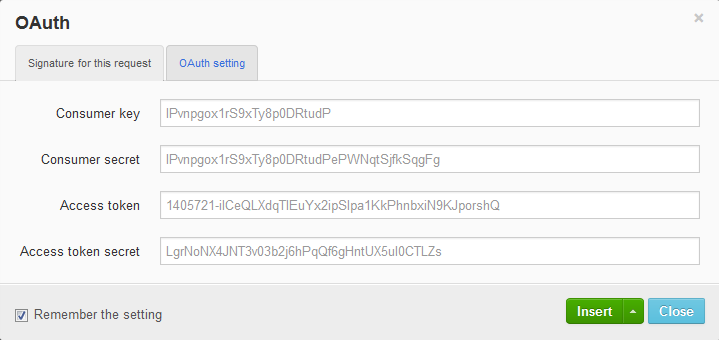

3.  In the OAuth window, on the Signature for the request tab, fill in the following fields:\
    - **Consumer key**: Enter the **Key** value provided when you created the consumer in Magento Admin Panel.
    - **Consumer secret**: Enter the **Secret** value provided when you created the consumer in Magento Admin Panel.
    - **Access token**: Enter the oauth_token value received when you authenticated the application.
    - **Access token secret**: Enter the oauth_token_secret value received when you authenticated the application.

4.  On the OAuth setting tab, define the following options: 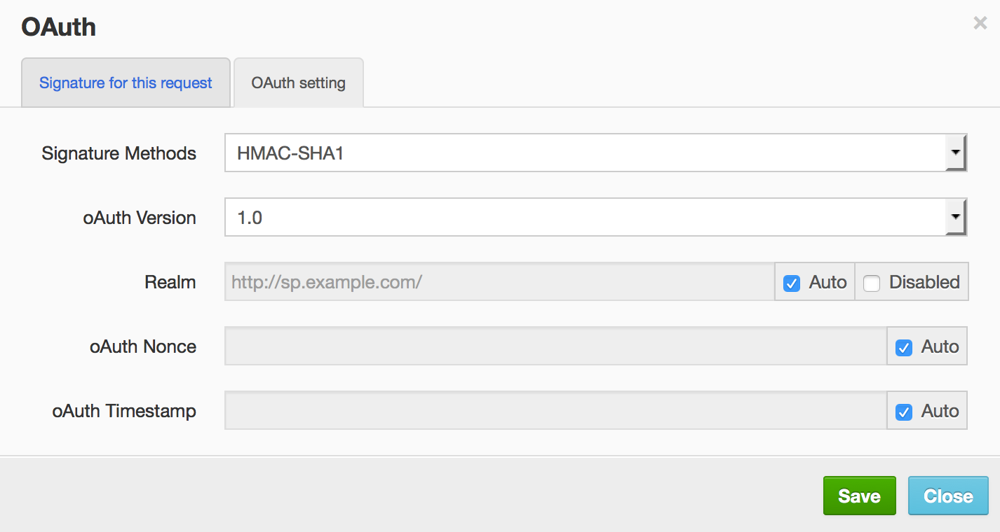
    - **Signature Methods**: From the drop-down list, select which method will be used for signatures (HMAC-SHA1 or PLAINTEXT).
    - **oAuth Version**: From the drop-down list, select the **1.0** option (REST API supports OAuth 1.0a).
    - Leave the **Realm**, **oAuth Nonce**, and **oAuth Timestamp** values set by default.

5.  Click **Save** and wait for the confirmation dialog to close.\

6.  Return to the Signature for the request tab and select **Insert \> Insert as header**. 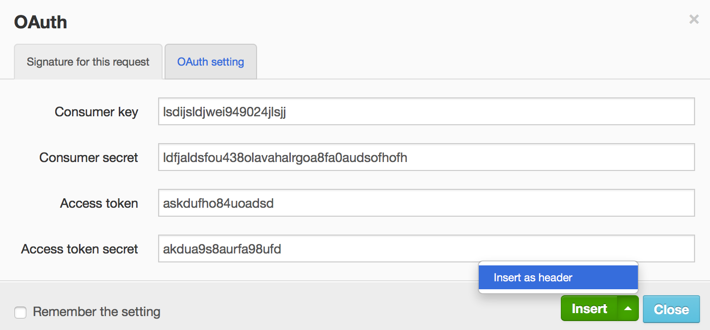

    An authorization header is created on the main page of REST Client.

    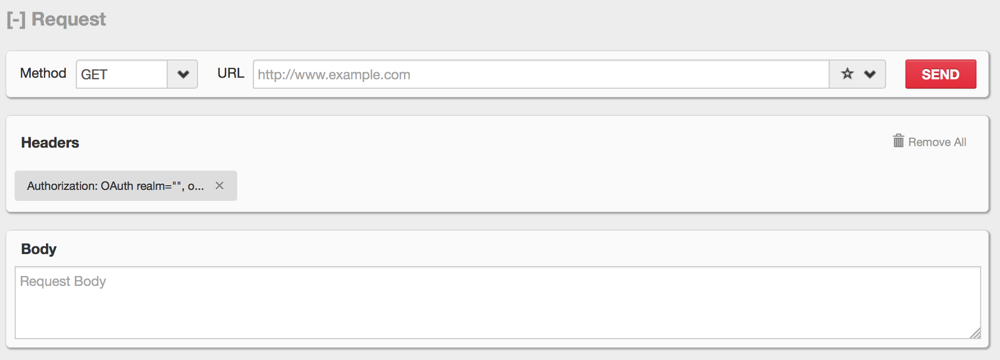

    **NOTE**: Click the header with authorization data and click **Auto refresh** in the opened pop-up in order to generate new values for oauth_nonce, oauth_timestamp, and oauth_signature at each request.\
    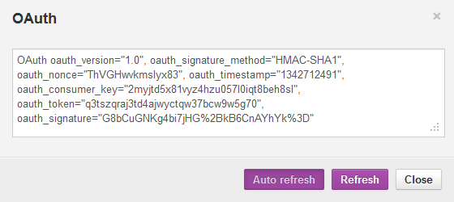

7.  From the **Headers** drop-down, select **Custom Header**.\
    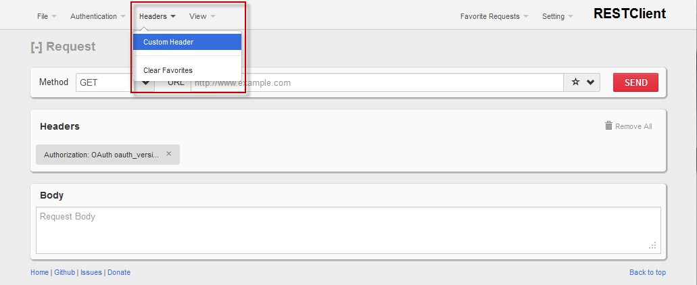

8.  In the **Request Header** window, enter "Content-Type" in the **Name** field and "text/xml" in the **Value** field (if you want to use the XML data format). To use the JSON request data format, enter application/json instead of the text/xml value.

9.  Click **Okay**.\
    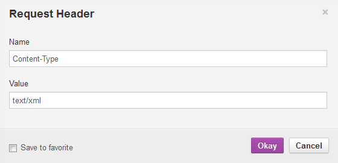

**Example: Retrieving the List of Products**

1.  From the **Method** drop-down list, select the **GET** option.
2.  In the **URL** field, enter the following URL: http://magentohost/api/rest/products. You can limit the number of products returned in the response. To set the limit to 4, enter the following URL: http://magentohost/api/rest/products?limit=4
3.  Click **Send**. Information about all products will be displayed in the response body. Example is as follows:\
    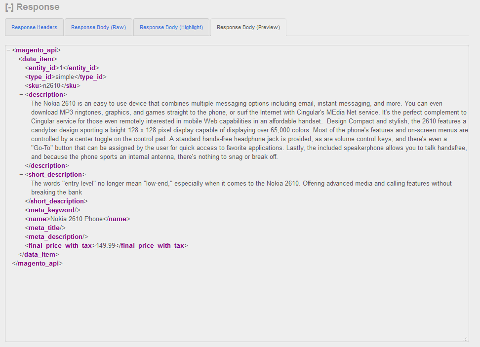

##### Testing REST resources with the [Advanced REST Client](https://chrome.google.com/webstore/detail/hgmloofddffdnphfgcellkdfbfbjeloo) for Google Chrome browser.

1.  Open the Advanced REST Client Application.\
    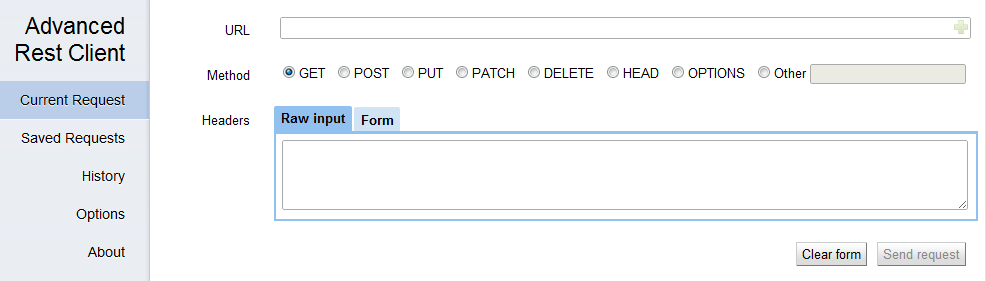
2.  In the **Headers** box, select the **Form** tab.
3.  In the first field, start typing *authorization*. An **Authorization** popup appears. Click it.\
    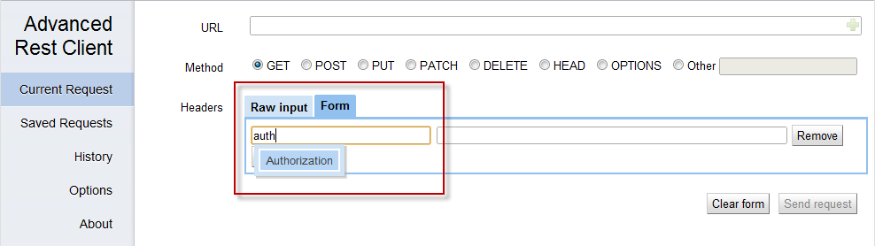
4.  When you click the fields next to the Authorization header, the **Construct** link appears. Click it to configure OAuth authentication.
5.  The Authorization window opens. Select the OAuth tab.\
    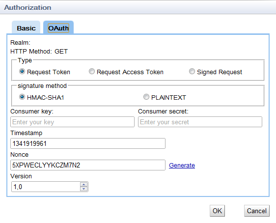
6.  In the **Type** group of options, select the **Signed Request** option.
7.  In the **signature method** group of options, select which method will be used for signatures (HMAC-SHA1 or PLAINTEXT).
8.  Fill in the following data:\
    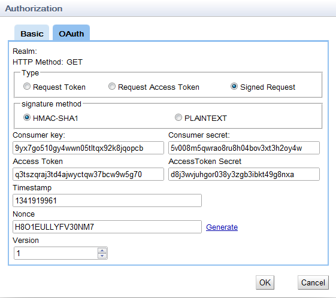
    - **Consumer key**: Enter the **Key** value provided when you created the consumer in Magento Admin Panel.
    - **Consumer secret**: Enter the **Secret** value provided when you created the consumer in Magento Admin Panel.
    - **Access Token**: Enter the oauth_token value received when you authenticated the application.
    - **Access Token Secret**: Enter the oauth_token_secret value received when you authenticated the application.
9.  Click **OK**.\
    **NOTE**: Advanced REST Client does not save the **Consumer secret** and **Access Token Secret** values. You need to enter these values each time you make a request.
10. In the **URL** field, enter the URL to which the API call will be performed and select the required HTTP method.
11. In the **Headers** table, click **Add row** and add the Accept - application/json or Accept - text/xml header depending on which format you prefer for the returned data.
12. Click **Send Request**.

**Example: Retrieving the list of customers**

1.  In the **Method** group of options, select the **GET** option.
2.  In the URL field, enter the following URL: http://magentohost/api/rest/customers.
3.  Click **Send request**. Information about all customers will be displayed in the response body. Note that only Admin type of the user can retrieve the list of customers. Example is as follows:\
    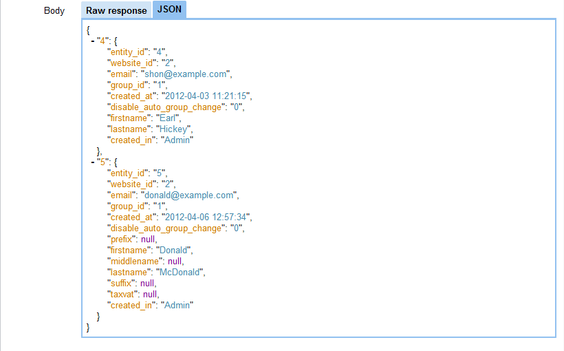

**Example: Creating a customer address**

1.  In the **Method** group of options, select the **POST** option.
2.  In the URL field, enter the following URL: http://magentohost/api/rest/customers/:id/addresses where the ":id" value is the customer ID in the system.
3.  In the **Body** table, on the **Raw input** tab, enter the data required for customer address creation.
4.  Click **Send request**. If the address is created, the 200 OK HTTP status code will be returned. Example is as follows:\
    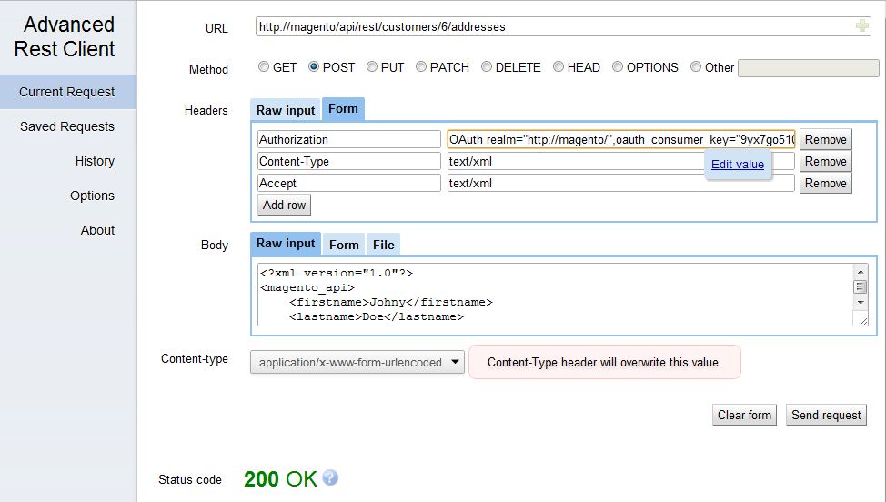

---
